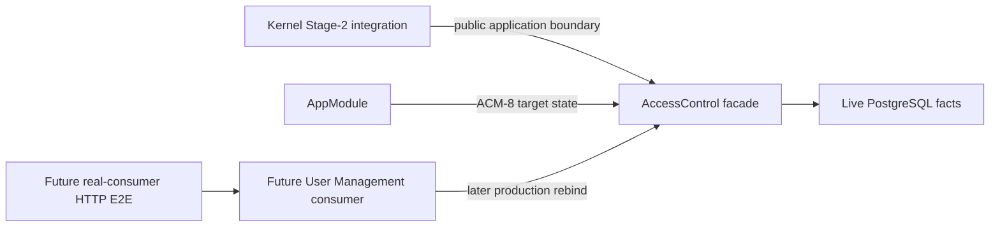

# Architecture Spine — Access Control Foundation

## Design Paradigm

Hexagonal Access Control bounded context. Its application facade is a valid
headless integration boundary for kernel verification. A User Management-owned
HTTP consumer may call the facade but retains route, response projection, port
binding, and UI ownership.

## Inherited Invariants

| Inherited | From parent | Binds here |
| --- | --- | --- |
| PM/AD-1 | People Management Architecture Spine | Human-approved Stage-1 scenario, then independently approved red Stage-2 evidence, precede any new production behavior; one dispatch covers one stage only. |
| PM/AD-2 / PM/AD-3 | People Management Architecture Spine | Hexagonal boundary; ordinary consumer Stage-2 uses real HTTP and PostgreSQL. The approved kernel exception is defined below. |
| PM/AD-6 / PM/AD-7 / PM/AD-8 | People Management Architecture Spine | Functional and access roles remain separate; policy attachments stay data-driven and equality-only. Local ACF/AD-4 refines PM/AD-7's incomplete FR schema for the Kernel MVP without repealing the future runtime catalog direction. |
| PM/AD-9 / PM/AD-10 | People Management Architecture Spine | The facade is the authorization entry point; audiences are live, bulk, split, and never persisted. |
| PM/AD-11 / PM/AD-12 | People Management Architecture Spine | Typed relationship facts and fail-closed resolution. |
| PM/AD-14 / PM/AD-19 | People Management Architecture Spine | User Management owns route shape; direct PP derives only from `people_partner` relationship fact. |
| PM/AD-20 | People Management Architecture Spine, scoped amendment below | Due/departure cutoff and dismissed-target projection remain the binding future target. Local ACF/AD-4 formally defers request-time due behavior for the entire Kernel MVP, explicitly ACM-0 through ACM-5; ACM-8 only composes and ACM-9 only measures. Later lifecycle/full-facade work gets no exception and still requires PM/AD-1. |
| PM/AD-22 | People Management Architecture Spine | Employment lifecycle owns employment state. Access Control departure participants never write `EmploymentStatus` or invent a parallel employment writer. |
| PM/AD-23 | People Management Architecture Spine | Any Access Control departure participant binds to the exact shared `applyDepartureEffects({ departureId, leaseToken, departingUserId, effectiveDate, tx })` contract (same signature, supplied `tx`, no nested transaction, idempotent on `departureId`). |
| PM/AD-24 | People Management Architecture Spine | HTTP denial oracle is 401 / 404 / 403 with hidden-target 404 first. Kernel Stage-2 evidence remains facade/integration; HTTP mapping stays User Management-owned. |

## Invariants & Rules

### AD-1 — Foundation boundary [ADOPTED, AMENDED 2026-08-30 P2]

- **Binds:** ACF-1 / CAP-1 / CAP-2 / ACM-3.
- **Prevents:** expanding a two-day foundation into profile projection, UI, or the full access-control program; deriving an audience before identity is confirmed; and describing traversal states the schema cannot represent.
- **Rule:** Implement only Self, live direct Reporting, direct assigned PP, Colleague fallback, empty-bulk short-circuit, and fail-closed malformed/orphaned fact handling. Project, Department, PP HR-line propagation, section matrices, functional permissions, shared links, full-profile overlays, writes, and projection remain deferred.
- **Identity before Self:** viewer identity validation — the viewer exists and is active — runs before any audience derivation, Self included. Self is exclusive only after **both** viewer and target are confirmed present and active; where the target is the viewer they are the same row and one confirmation settles both. An unconfirmed viewer or target yields an empty audience `Set`: never Self, and never the Colleague floor.
- **Cycle rule:** repetition is path-local to one requested target; shared ancestors across target walks are not repeats. Reaching the viewer proves the viewer sits on that target's chain but is **provisional** — it does not by itself grant Reporting. The walk continues to chain termination, and Reporting is granted only when that target's whole walked chain terminates without repeating a node. A repeated node anywhere in the chain, **before or after viewer proof**, denies Reporting only for that target, so a viewer inside a cycle is denied rather than proven. Self and direct PP remain independently evaluated, and Colleague follows the ordinary no-stronger-audience fallback.
- **Chain-termination taxonomy:** an **absent** manager edge is a clean end — the walked chain is complete. An edge whose **endpoint is inactive** is unusable and is treated as absent for traversal: before viewer proof the viewer is unproven and Reporting is denied; after viewer proof the chain has terminated without a repeat, so Reporting is granted and nothing above the dead node becomes reachable. An edge whose **endpoint row is missing** is unreachable in supported operation — `relationships_shape_check` requires a non-null `reportsToUserId` on `direct` and `people_partner` rows and the endpoint foreign key is `ON DELETE RESTRICT` — so it is recorded as an invariant and kept as a defensive rule, never required as a constructible Stage-2 scenario. `User` has no soft-delete column; no soft-deleted `User` or bridge state is described anywhere in this MVP.

### AD-2 — User Management ownership boundary [ADOPTED]

- **Binds:** the future Access Control facade and its consuming HTTP path.
- **Prevents:** Access Control modifying User Management controllers, guards, adapters, response projection, or frontend code.
- **Rule:** Access Control provides a domain/application facade. User Management alone chooses and owns the existing/future HTTP endpoint and observable response projection that consumes it.

### AD-3 — Kernel evidence and consumer evidence are separate [AMENDED 2026-08-30 P2]

- **Binds:** ACM-0, ACM-1, ACM-2, ACM-3, ACM-4, ACM-5, ACM-8, ACM-9, and the future User Management integration story.
- **Prevents:** inventing an HTTP route to test a headless facade; treating component evidence as production `/users` enforcement; blocking kernel work on a consumer contract it does not own.
- **Historical rule:** ACF-1 keeps its existing failed gate and evidence record. This amendment does not rewrite that result.
- **Kernel rule:** Stage-2 for new Kernel MVP behavior calls the public `AccessControlFacade` through a real Nest testing module with the real `AccessControlModule`, real Prisma adapters, migrated PostgreSQL, and no Access Control repository fake or User Management provider override. The evidence is an integration gate, not HTTP E2E. ACM-0 is the one exception in subject, not in rigor: its subject is the deploy-time root User step, so its Stage-2 evidence runs against migrated PostgreSQL without a facade call, while repository fakes, User Management provider overrides, and artificial HTTP endpoints stay prohibited.
- **Consumer rule:** production `/users` adoption still requires a User Management-owned contract, production `ACCESS_CONTROL_PORT` rebinding, projection, and real HTTP → router → authentication → Access Control → PostgreSQL E2E without provider overrides.
- **Prohibition:** no test-only, debug, or artificial HTTP endpoint may be created to make the kernel gate look like consumer E2E. Kernel evidence never replaces the future consumer gate.
- **Production-entrypoint rule:** where a story's subject is a deploy-time step rather than a facade call, its Stage-2 evidence invokes that story's **exact named production entrypoint** against migrated PostgreSQL. Re-implementing the step's normalization, eligibility, or bootstrap logic inline in a test does not satisfy the story, because it proves the test rather than the deployed path. ACM-0's entrypoint is `services/backend/prisma/seed.ts` (`npm run db:seed`); ACM-1's is `services/backend/src/access-control/infrastructure/bootstrap/access-control-bootstrap.ts` wrapped by `services/backend/scripts/bootstrap-access-control.ts` (`npm run db:bootstrap:access-control`). Deployment order is `db:deploy` → `db:seed` → `db:bootstrap:access-control` → `start:prod`.
- **Persisted approval rule — WITHDRAWN 2026-09-04.** This rule required every AD-1 stage approval to be recorded in the append-only ledger `_bmad-output/specs/spec-access-control-kernel-mvp/approvals.yaml` (`story_id`, `stage`, `repo`, `artifact_path`, `commit`, `author`, `approver`, `decision`, `timestamp`), with `author` and `approver` differing, and blocked a dispatch until the prior stage's record existed and verified. **AD-1 no longer requires stage approval**, so nothing is appended to that ledger any more and no dispatch is blocked by it. The ledger is retained unedited as history — its 113 entries record decisions that were genuinely made, and all 113 still resolve against the repositories they name. The `repo` field's rationale is kept here because it remains true of any future two-repository record: the workspace spans two git repositories, so a bare revision cannot identify which one. Full statement of the change in `docs/architecture/testing-strategy.md`.
- **Conditional-dependency rule:** a dependency that is conditional on an outcome is checked against persisted artifact state, never against free-text ordering. ACM-5 requires `_bmad-output/implementation-artifacts/access-control/acm-4-disposition.yaml` with `disposition: no-gap`; ACM-8 and ACM-9-final require the ACM-9 baseline artifact with `status: PASS`. Each is an exact path/field/value triple a validator can check.

### AD-4 — Minimal functional-role kernel [AMENDED 2026-08-30 P2]

- **Binds:** ACM-0, ACM-1, ACM-2, OQ-3, OQ-4, OQ-6, OQ-7, OQ-11.
- **Prevents:** role-name or position checks, target sentinels on global roles, AR-policy permission links, duplicate evaluators, root-attachment transfer, unapproved default grants, and an MVP catalog API being mistaken for a normative product contract.
- **Rule:** `Policies.id` is `roleId`, and `Policies.type` is non-null and restricted to `FR|AR`. FR rows require a non-null `targetRole` role key and have `targetType IS NULL` and `targetId IS NULL`; AR rows have both target values. Reviewed custom PostgreSQL migration SQL enforces that `CHECK` and unique FR role keys. `PolicyPermissions(policyId, permissionId, policyType)` has composite pair uniqueness, a permission-first index, `policyType NOT NULL DEFAULT 'FR' CHECK (policyType = 'FR')`, a restrictive composite foreign key `(policyId, policyType)` to a unique `Policies(id, type)` key, and a restrictive foreign key to `Permissions`; an AR policy therefore cannot be linked. The functional-role slice owns the live, data-driven `isAllowed`; `AccessControlFacade` only delegates and exposes it. Its public permission key is an open, case-sensitive string constrained by lowercase `context:action` syntax, never a closed three-value type. Authorization joins `User.isActive`, `UserPolicies`, `type='FR'` policies, policy-permission grants, and the immutable unique permission key; it never compares `targetRole`, `User.position`, or a role name. Unknown, differently-cased, or nonmatching data denies; infrastructure failures reject without an authorization result. Permission keys are append-only identities; no writer may update one in place or bypass the Access Control-owned mutation boundary.
- **Bootstrap rule:** The deploy-time root User step, outside ACM-1, **creates and validates** the root identity so a fresh migrated database is satisfiable without an unnamed external prerequisite. It normalizes `ROOT_WORK_EMAIL` by DEC-UM-007, stores the normalized value so storage is canonical, and ensures exactly one active User whose normalized `workEmail` equals it; unrelated active employees never affect the count. The Kernel SPEC tracks this as CAP-8 and dispatches it as the ACM-0 AD-1 sequence immediately before ACM-1, with the named entrypoint in AD-3. It authorizes no User Management API, CRUD, runtime role management, or other User Management feature, and it does not implement User Management Story 1.1's population import — that import is not blocked, but DEC-UM-009 already constrains it, since no writer may create a second row for a normalized email that already exists, so an import covering the root person reuses the root `User` id rather than inserting a second row. One Access Control-owned `AccessControlBootstrap` singleton keyed `root-hr-admin` durably records `normalizedRootEmail`, `rootUserId`, and `policyId` with unique identity and restrictive references; later administrator-created `hr-admin` attachments are not bootstrap state. Every ACM-1 transaction first acquires a common transaction-scoped PostgreSQL advisory lock derived from `access-control:bootstrap:root-hr-admin`, then locks/revalidates the singleton, candidate User, and recorded attachment before writes and before commit. Lock timeout, missing/ambiguous/inactive identity, configuration mismatch, or attachment mismatch fails atomically with actionable diagnostics.
- **Normalized identity rule:** identity is canonical **at write**, not merely at lookup. `users_workEmail_key` indexes the raw stored value, so normalized uniqueness holds only because every writer stores the normalized form; the database does not enforce it. Exact-one eligibility therefore counts **all** normalized matches first and checks active state only afterwards — a count other than one fails as unmatched or ambiguous **before** `isActive` is consulted, so two rows differing only in case with one inactive cannot resolve to a single active match. A normalized match that is not the intended root is never adopted, mutated, or reactivated. Concurrent runs converge: the loser of the insert race takes the unique violation on `users_workEmail_key`, re-reads, and re-runs the exact-one validation, leaving no partial state. Pre-existing non-normalized rows can still yield more than one normalized match; the step fails closed and the database-enforced fix is deferred (see Deferred).
- **Bootstrap provenance rule:** with the singleton **absent**, ACM-1 adopts an existing FR `hr-admin` policy by natural key (`targetRole='hr-admin' AND type='FR'`) after verifying `operator='=='`, `managedBy='admin'`, and null `targetType`/`targetId`, and adopts an existing `hr-admin` attachment **only when that attachment already belongs to the located root**, then writes the singleton. Attachments belonging to anyone else remain non-bootstrap administrator state and are neither adopted nor transferred; the located root gets its own attachment. A changed configured root with no singleton has no recorded provenance and therefore no drift to detect. With the singleton **present**, a changed normalized `ROOT_WORK_EMAIL` is conflicting drift: ACM-1 fails atomically and neither transfers the attachment nor creates a second root attachment. The asymmetry is deliberate and security-relevant. More than one candidate root attachment is impossible because `UserPolicies` is keyed `(userId, policyId)`.
- **Cross-type collision rule:** FR role-key uniqueness is the **partial** index `UNIQUE targetRole WHERE type='FR'`, so an AR policy carrying `targetRole='hr-admin'` is legal and is a different object. ACM-1's lookup and ACM-2's evaluation always filter `type='FR'`. That AR row is never adopted, mutated, counted toward cardinality, or reported as drift, and it is preserved; it can hold no permission grant because `PolicyPermissions` fixes `policyType='FR'` by `CHECK` and references `Policies(id, type)` compositely; and a `UserPolicies` row attaching a user to it is not an `hr-admin` functional-role attachment and is never bootstrap state.
- **Invariant-coverage rule:** ACM-1 Stage-1 and Stage-2 cover every CAP-3 database invariant — non-null `FR|AR` policy type; the FR/AR row-shape `CHECK`; the partial unique FR role key; the `Policies(id, type)` support key; unique immutable `Permissions.key`; `PolicyPermissions` pair uniqueness; the `policyType='FR'` discriminator with its restrictive composite foreign key rejecting an AR grant; the restrictive `Permissions` foreign key; the permission-first `(permissionId, policyId)` index; `UserPolicies` integrity including rejected bad-user, bad-policy, and duplicate attachments; the `AccessControlBootstrap` singleton constraints; and `ON DELETE RESTRICT` on all four functional-role-side foreign keys. Index existence is observable evidence: the permission-first index is asserted by querying `pg_indexes` against the migrated database, which is legitimate Stage-2 evidence rather than a facade behavior.
- **MVP reduction:** On a fresh database the deploy-time catalog has no HTTP mutation surface and contains exactly `user-management:create`, `user-management:deactivate`, and `user-management:list`; exactly one `hr-admin` policy grants those three; exactly one normalized active root User is attached; there are no other seed-owned default grants. The transactional seed is idempotent and non-destructive: reruns ensure the bootstrap identities, fail atomically on conflicting seed-owned drift, and never delete or rewrite later non-bootstrap catalog rows or attachments. AD-20 due/departure enforcement is deferred because the Kernel MVP has no Departure persistence seam; this does not weaken `User.isActive` or retire the documented future dismissed-target projection. `/roles`, runtime role management, and the complete §2.3 catalog remain deferred without constraining their future contract.

## Capability → Architecture Map

| Capability / Area | Lives in | Governed by |
| --- | --- | --- |
| CAP-1 Phase-0 audience resolution | `access-control` domain/application facade | inherited AD-2, AD-9, AD-10; local AD-1 |
| CAP-2 fail-closed resolution | `access-control` domain resolver | inherited AD-11, AD-12; local AD-1 |
| Inactive identity results | `access-control` audience resolution (ACM-3) | AD-11, AD-12; empty `Set` for inactive viewer/target |
| Multi-audience inputs | `access-control` audience resolution (ACM-4) | AD-10; no section decision in ACM-4 |
| Deploy-time root User identity (CAP-8) | `services/backend/prisma/seed.ts` via `npm run db:seed` (ACM-0) | AD-4 bootstrap + normalized identity rules; AD-3 production-entrypoint rule |
| Functional permission data/evaluation | `access-control` FR ports and services (ACM-1/2); `AccessControlFacade` exposes the result | AD-4; ACM-1 owns data and ACM-2 owns the evaluator |
| S1/S10/S11 base decision | `access-control` section service (ACM-5) | AD-9, AD-10; no projection |
| Kernel composition | root `AppModule` (ACM-8) | local AD-2/AD-3; no UM rebind |
| Kernel performance evidence | direct facade on PostgreSQL (ACM-9) | 500-target absolute gate, representative Reporting/direct PP/Colleague/mixed graphs, separate baseline and final artifacts |
| HTTP observability and projection | future User Management-owned consumer | inherited AD-3, AD-14; local AD-2, AD-3 |

## Decision Register

Local AD headings below are **ACF/AD-1..ACF/AD-4** (`spine_id: ACF`). Parent People Management decisions are cited as **PM/AD-n**.

| Status | Item | Action / owner |
| --- | --- | --- |
| **Historical FAIL preserved** | ACF-1 feature-to-audience mapping and production `/users` wiring | Keep `_bmad-output/test-artifacts/gate-decision.json` unchanged as the historical result. |
| **OQs resolved; package review approved 2026-08-31** | OQ-3, OQ-4, OQ-6, OQ-7, OQ-11 | ACF/AD-4 is binding input. Frontmatter `package_review_approved: 2026-08-31` and `implementation_status: stage-1-authorized` control dispatch. |
| **One gate statement** | FR-AMD-1 authority | Architecture decisions are approved and final under `approval_scope: architecture-decision-only`. Kernel package review is approved; Stage-1 follows ACF/AD-1. |
| **Executable, not assumed** | CAP-8 / ACM-0 on a fresh database | ACM-0 creates and validates the normalized root User at a named entrypoint. No unnamed external prerequisite remains in the package. |
| **Persisted, verifiable** | AD-1 stage approvals | `approvals.yaml` ledger with `author != approver` and a resolvable commit + artifact per record; a prose assertion is not an approval. |
| **Checked against artifact state** | ACM-5 and ACM-8 / ACM-9-final gating | `acm-4-disposition.yaml` `disposition: no-gap`; ACM-9 baseline `status: PASS`. |
| **Named residual risk** | Normalized `workEmail` uniqueness | Not database-enforced. ACM-0 fails closed on multiple normalized matches; the functional unique index is separately gated deferred work. |
| **Blocks each new production behavior** | AD-1 sequence | Independent Stage-1 approval, separate approved red kernel integration evidence, then production; one dispatch per stage. |
| **Does not block the kernel** | User Management consumer contract and HTTP mapping | Defer to the separate User Management-owned integration story; it keeps the product gate open. |
| **Pointed 2026-08-31** | User Management consumer contract and HTTP mapping | The six `um-integration-contract-request.md` questions are answered in `../../../implementation-artifacts/access-control/um-integration-contract-response.md`; production `ACCESS_CONTROL_PORT` rebind, per-route mapping, projection boundary, and real-consumer HTTP E2E are owned by `../../../specs/spec-user-management-access-control-adoption/`. The product gate stays open until that package and the separate Profile Projection story land. |

## Deferred

- The full 171-file Phase-1 Access Control suite and all of its deferred slices remain governed by their existing specifications; this spine neither approves nor replaces them.
- This spine does not choose a User Management endpoint or response shape. Doing so would violate the User Management ownership boundary.
- **MVP reduction:** `/roles`, permission-catalog HTTP mutation, runtime role
  management, and the complete §2.3 permission catalog remain out of the Kernel
  MVP without constraining their future normative contract.
- Before any future User Management FR-attachment story, its contract must
  reference an existing `Policies.id` / `roleId`; the current inline FR policy
  body in `api-conventions.md` is superseded for FR and must be synchronized.
- Projection, frontend work, Project, Department, PP HR-line, shared links, and
  full-profile overlays remain out of the Kernel MVP.
- **Database-enforced normalized `workEmail` uniqueness is deferred.**
  `users_workEmail_key` indexes the raw stored value, and DEC-UM-007's claim
  that uniqueness is enforced on the normalized value is not true of the
  database today. The Kernel MVP relies on writer-side canonicalization
  instead. A unique functional index over the normalized value is a migration
  on the `users` table, past CAP-8's stated boundary, and is recorded as
  separately gated work in `deferred-work.md`. This spine does not choose its
  shape; it only records that the guarantee is currently writer-side.
- AD-20 request-time due/departure enforcement remains future work until a
  Departure persistence seam exists. Its documented current-manager/direct-PP
  read-only dismissed-target projection remains the future target and is not
  redefined by this MVP deferral. A new AD-1 sequence is still required after
  the seam exists; the seam's appearance does not authorize implementation.
- The exact ACM-9 depth sequence is an operational measurement protocol, not
  normative product behavior. The binding architecture requires 500 targets,
  representative Reporting/direct PP/Colleague/mixed graphs, separate baseline
  and final artifacts, immediate stop on the first absolute threshold breach,
  and failure on warm-p95/worst-case above two seconds or statement timeout.
  A post-composition slowdown within both absolute limits is recorded only.
  `ACM9-MVP-v1` in `docs/architecture/testing-strategy.md` fixes sampling,
  percentile, timing, fixture, and comparison rules. Every started run emits
  an immutable append-only `PASS|FAIL|INCOMPLETE` artifact with run/role IDs,
  protocol, fixture, and environment-manifest identities,
  revisions/environment, completed results,
  first breach or timeout, and stop reason; a final artifact references its
  comparable baseline and never overwrites it. Baseline and final environment
  hashes cover PostgreSQL configuration/version, runtime, CPU/memory limits,
  database topology, and isolation/load policy. **Precedence [AMENDED
  2026-08-30 P2]:** a recorded warm-p95 or worst-case value above two seconds,
  or a statement timeout, always finalizes the run `FAIL` whether or not the
  manifest matches, because the gate is absolute rather than comparative. A
  mismatch sets `comparability: mismatched` and suppresses the baseline
  slowdown comparison; a mismatched run recording no breach finalizes
  `INCOMPLETE`. A mismatch can never upgrade a run to `PASS` and never erases a
  recorded breach, superseding the earlier rule that a mismatch produces no
  absolute verdict. Reservation is two-phase and precedes fallible setup, and
  non-timeout infrastructure errors finalize `INCOMPLETE` with an error class,
  never `PASS` and never `FAIL`.
