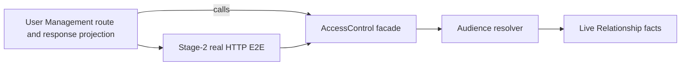

# Architecture Spine — Access Control Foundation

## Design Paradigm

Hexagonal Access Control bounded context. Its domain resolves relationship-derived audiences; a User Management-owned HTTP consumer may call the facade but retains route, response-projection, and UI ownership.

## Inherited Invariants

| Inherited | From parent | Binds here |
| --- | --- | --- |
| AD-1 | People Management Architecture Spine | Human-approved Stage-1 scenario, then independently approved red HTTP E2E, precede any production code. |
| AD-2 / AD-3 | People Management Architecture Spine | Hexagonal boundary; Stage-2 uses real HTTP and real test database. |
| AD-9 / AD-10 | People Management Architecture Spine | The facade is the authorization entry point; audiences are live, bulk, split, and never persisted. |
| AD-11 / AD-12 | People Management Architecture Spine | Typed relationship facts and fail-closed resolution. |
| AD-14 / AD-19 | People Management Architecture Spine | User Management owns route shape; direct PP derives only from `people_partner` relationship fact. |

## Invariants & Rules

### AD-1 — Foundation boundary [ADOPTED]

- **Binds:** ACF-1 / CAP-1 / CAP-2.
- **Prevents:** expanding a two-day foundation into profile projection, UI, or the full access-control program.
- **Rule:** Implement only Self, live direct Reporting, direct assigned PP, Colleague fallback, empty-bulk short-circuit, and fail-closed malformed/orphaned fact handling. Project, Department, PP HR-line propagation, section matrices, functional permissions, shared links, full-profile overlays, writes, and projection remain deferred.

### AD-2 — User Management ownership boundary [ADOPTED]

- **Binds:** the future Access Control facade and its consuming HTTP path.
- **Prevents:** Access Control modifying User Management controllers, guards, adapters, response projection, or frontend code.
- **Rule:** Access Control provides a domain/application facade. User Management alone chooses and owns the existing/future HTTP endpoint and observable response projection that consumes it.

### AD-3 — Candidate integration requires a User Management-owned contract

- **Binds:** Stage-1 and Stage-2 work for ACF-1.
- **Prevents:** invented routes, response shapes, or untestable resolver-only evidence.
- **Rule:** `GET /users/:id` is the candidate HTTP consumer: it already has a target-scoped guard, but currently binds the temporary `InterimAccessControlAdapter`, whose target check only tests whether `userId` is non-empty. Before authoring HTTP scenarios, the User Management owner must approve the replacement port contract, target/bulk input shape, observable response-level effect of resolved audiences, and branch/commit that will contain the wiring. Until then the foundation is design-ready but not Stage-1/E2E-ready.

## Capability → Architecture Map

| Capability / Area | Lives in | Governed by |
| --- | --- | --- |
| CAP-1 Phase-0 audience resolution | `access-control` domain/application facade | inherited AD-2, AD-9, AD-10; local AD-1 |
| CAP-2 fail-closed resolution | `access-control` domain resolver | inherited AD-11, AD-12; local AD-1 |
| HTTP observability | User Management-owned endpoint/projection | inherited AD-3, AD-14; local AD-2, AD-3 |

## Decision Register

| Status | Item | Action / owner |
| --- | --- | --- |
| **Does not block ACF-1** | PP mutation and journal details; scheduled departure; full-profile mapping; Project, Department, timetracker behavior | Keep out of the foundation. Resolve only in their dedicated slices. |
| **Blocks ACF-1 Stage-1/E2E** | Confirmation that `GET /users/:id` replaces the temporary target-check adapter, plus its observable contract | User Management developer provides the integration contract in AD-3. Requested 2026-08-30 — `../../../implementation-artifacts/access-control/um-integration-contract-request.md`; ACF-1 waits rather than substituting non-HTTP evidence. |
| **Blocks production code after that** | AD-1 gate | Independent human approval of the dedicated Stage-1 scenario(s), then independent approval of red HTTP E2E. |

## Deferred

- The full 171-file Phase-1 Access Control suite and all of its deferred slices remain governed by their existing specifications; this spine neither approves nor replaces them.
- This spine does not choose a User Management endpoint or response shape. Doing so would violate the User Management ownership boundary.
- No technology, schema, or framework choice is newly introduced here; existing backend conventions and parent decisions remain binding.
