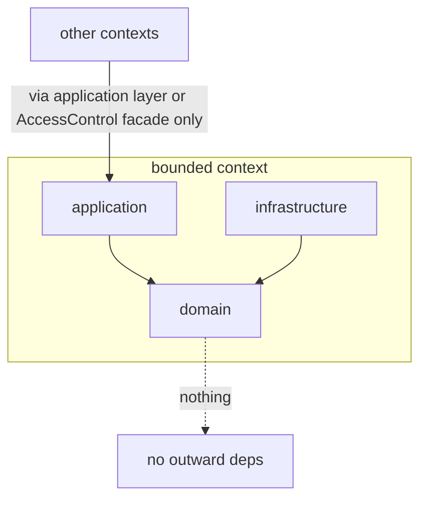
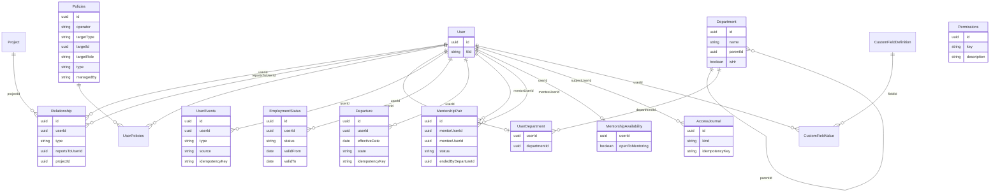

# Architecture Spine — People Management Platform

## Design Paradigm

**Hexagonal (ports & adapters) over DDD bounded contexts.** The backend is a set of bounded contexts; inside each, domain logic depends on nothing but itself. Inbound HTTP is one adapter; persistence and every external system sit behind outbound ports (NestJS DI tokens). Layer → directory mapping per context:

```text
<context-name>/
  application/
    actions/        # use cases
    controllers/    # inbound HTTP adapter
    dtos/           # boundary shapes
  domain/
    interfaces/     # ports (DI token contracts)
    services/       # domain services
    entities/       # rich entities with behavior
  infrastructure/
    *.repository.ts # persistence adapters (Prisma)
    *.adapter.ts    # external-system adapters
```



Dependency rule: `application` and `infrastructure` depend on `domain`; `domain` depends on nothing outside itself. Cross-context calls go through the target context's application layer or the AccessControl facade — never into another context's domain or infrastructure.

## Invariants & Rules

### AD-1 — Three-stage quality gate per feature

- **Binds:** all — every feature, every developer
- **Prevents:** test or production code written against an un-agreed scenario; misunderstandings caught at the expensive stage instead of the cheap one
- **Rule:** (1) scenario/test-case document in `/docs/test-cases/` (line-by-line: actor → request → expected outcome, traced to a requirements section), approved by a developer; (2) E2E test translated from the approved scenario, approved by a developer; (3) only then production code, until that test passes. No production code without a preceding red E2E test in history.
- **Extended 2026-08-26** (human-flagged during Story 1.1: an agent dispatch wrote the scenario doc, the E2E tests, and production code in one uninterrupted run, then declared in its own report that it had "reviewed the scenario docs against the spec" and treated that self-review as the stage-1 approval): **a gate stage is never self-certified.** "Approved by a developer" means a human being sees the actual artifact and says so — an agent's own review of its own prior output is not an approval, no matter how it's phrased in a report. Concretely: (a) no single agent dispatch may span more than one gate stage — write the scenario doc, then stop; write the E2E test, then stop; each stop surfaces the real artifact (full scenario text, or the actual test file) and waits for an explicit human "approved" before the next stage begins; (b) this holds even under time/token pressure, and even when a generic build workflow's own default cadence doesn't itself force a pause — AD-1 overrides that default, every time, for every feature.

### AD-2 — Hexagonal boundary is absolute

- **Binds:** all backend code
- **Prevents:** domain logic coupling to HTTP, Prisma, or third-party SDKs, which would block fake-backed E2E tests and graceful integration degradation (NFR §7)
- **Rule:** domain code imports nothing from `application/`, `infrastructure/`, NestJS transport, Prisma, or external SDKs. External systems (timetracker, PeopleForce) are outbound ports with adapter implementations.
- **Extended 2026-08-26** (human-flagged in Epic 1 review): the boundary runs both ways. `application/actions/` never `@Inject` a port token directly — only `domain/services/` may hold a port; actions call the domain service. A port interface living in `domain/interfaces/` does not make it safe for `application/` to inject it — full rationale and the one sanctioned exception (auth-gating guards) in `domain-driven-design.md` and `nestjs-di-tokens.md`.

### AD-3 — E2E means real API, faked integrations

- **Binds:** test infrastructure, CI
- **Prevents:** slow/flaky suites blocked by third parties; tests that don't assert what the API actually returns (NFR §7)
- **Rule:** gate-stage-2 tests exercise real HTTP → router → access resolution → real test database. Outbound integration ports are rebound via their DI tokens to fixture-backed fakes in the test module. Live third-party calls in the E2E suite are forbidden.

### AD-4 — The gate is per feature-owner

- **Binds:** team workflow, branching
- **Prevents:** a centralized test-author becoming a serialization point (violates §8.2 mandatory parallelism)
- **Rule:** the feature owner drives their own scenario → test → code sequence; approvals are asynchronous reviews, never a blocking handoff to a dedicated role.

### AD-5 — Bounded contexts with the standard internal layout

- **Binds:** repo structure, team decomposition
- **Prevents:** contexts inventing incompatible layouts; parallel teams colliding in one module
- **Rule:** every context uses the `application/domain/infrastructure` layout from the Design Paradigm. Confirmed contexts: `user-management` (org facts, employment, UserEvents, profile HTTP/envelope), `access-control`, `dashboards` (fixed read-model composer), `mentorship`, `action-items`. Others (resourcing, cds, risk, feedback, campaigns) pending confirmation — see Deferred.
- **Amended 2026-09-01** (mentorship technical design): `mentorship` is a **confirmed** `src/mentorship/` bounded context with the standard layout — the willing-mentor pool, the `MentorshipAvailability` open-to-mentoring aggregate, the durable `MentorshipPair` record, mandatory-note closure, the S13 read projection, the profile-header mentor field, and departure auto-close. Binding design: `docs/architecture/mentorship.md`. It consumes `user-management`'s career-event application boundary and the `AccessControl` facade; it exposes read models to the profile assembler and `applyDepartureEffects` to the AD-20 executor.
- **Amended 2026-09-02** (user batch sign-off): `mentorship` ownership is approved. It owns `MentorshipPair`, `MentorshipAvailability`, derived mentorship status, the willing pool, pair lifecycle, closure notes, and its read projections. It does **not** own authorization, `UserEvents` persistence, employment orchestration, the All Employees filter engine, or TimeTracker. Documented API routes and the shared-transaction career-event and departure boundaries are approved; feature delivery still runs AD-1. `action-items` is a **confirmed** `src/action-items/` bounded context. It exports the shared `applyDepartureEffects` contract (AD-23). Departure cancels only open items **assigned to** the departing user; items authored by the departing user for active assignees remain active. Cancelled status, a fixed system reason, `cancelledAt`, and `sourceDepartureId` (or equivalent idempotency marker) persist. Manual and campaign-generated items follow the same assignee rule. No new campaign lifecycle is invented.
- **Amended 2026-09-02** (architect design batch): `user-management` also owns profile HTTP assembly and the data/canEdit envelope (AD-34). No `profile` bounded context. `dashboards` is confirmed as a composer of four fixed read models, not a generic widget engine (AD-33). `UserEvents` persistence remains solely in `user-management` (AD-30).

### AD-6 — Two role dimensions never collapse (vocabulary invariant)

- **Binds:** all entities, services, method and table names
- **Prevents:** the §2 dimension-collapse mistake entering through naming
- **Rule:** functional roles are assigned: `assignFunctionalRole` / `revokeFunctionalRole` are the only role-mutation methods anywhere. No method, flag, or column ever grants/revokes/stores an access role — access roles (Manager, PP, Colleague, Self tiers) exist only as computed output of tier resolution (AD-10).

### AD-7 — Access control is one policy-attachment engine [ADOPTED]

- **Binds:** access-control context; every context that checks anything
- **Prevents:** per-context role logic; schema changes when new assignable capabilities appear
- **Rule:** AWS-style attachment model. Tables: `Policies {id uuidv7, operator, targetType, targetId (uuid, polymorphic, no DB FK), targetRole, type 'AR'|'FR', managedBy 'sync'|'admin'}`, `Permissions {id uuidv7, key, description}` (granular feature list per §2.3), `UserPolicies {userId, policyId}`. The binding physical identity of a permission is `Permissions.key`: unique, append-only, lowercase `context:action`. `title` is **not** the identity field and must not be treated as one. Project/department managerial grants are policy attachments — `Project` carries no `pmUserId`/`dmUserId` and no `users[]` array. People Partner assignment is not a policy: it is the organisational `Relationship type='people_partner'` fact from which the PP audience is derived (AD-19); the §3.2 matrix/policy projection then decides that audience's section access. FR policies are runtime-editable via HR Admin UI (§2.3); AR policies are seeded by init script and have no UI.
- **Amended 2026-09-02** (H4): ACF/AD-4 supersedes/refines this AD's earlier physical shape `Permissions {id, title, description}`. Live identity is `key`; evidence-matrix divergence that recorded `title` vs `key` is closed as an AD refinement, not as unresolved conflict.

### AD-8 — Operator whitelist; negation barred from access grants

- **Binds:** policies engine
- **Prevents:** fail-open by absent data (a user on no projects satisfies every `!=` condition); non-SQL evaluation on the hot path
- **Rule:** operators start at `==` and `IN`. `!=` is barred from AR/tier-granting rules (FR-scoping/deny-only, if ever needed). Any operator not expressible as an indexed SQL join is barred from tier resolution entirely.

### AD-9 — AccessControl facade is the only authorization entry point

- **Binds:** all contexts
- **Prevents:** `isManager || isPP`-style flag checks scattering across the codebase
- **Rule:** two call shapes, never mixed: `isAllowed(feature)` for FR capability checks (no target), and tier/section checks that always take target-employee scope. Direct policy-table reads or role flags outside the facade are forbidden.

### AD-10 — Audience resolution is bulk, live, split, and never stored

- **Binds:** access-control context; every list/profile/dashboard endpoint; NFR §7 (500 records / 2 s); §3.4 relationship-and-access journal
- **Prevents:** per-row graph walks; stale-grant leaks; torn reads; collapsing Reporting and Project line into one tier; compound reporting→project chains that grant Reporting-line matrix cells to project-only viewers
- **Rule:** Per request, resolve **audiences** per viewer×target employee — never a single merged "Manager-line." The §3.2 matrix columns are **Reporting line**, **Project line**, **PP**, **Self**, and **Colleague** (plus shared-link and full-profile overlays). Derived access decisions are never persisted. **Three manager relations (§2.1), two matrix audiences:**
  1. **Reports-to** and **department management** → **Reporting line** only. One recursive SQL pass walks `Relationship type='direct'` (reports-to tree) and, when live, `Policies targetType:'department'` manager attachments over nested department membership (§4.17). This graph does **not** include project PM/DM attachments.
  2. **Project PM/DM assignment** → **Project line** only. Target project membership is `Relationship type='project'` (display/S11 only). A separate pass grants Project-line **only** to viewers who hold an explicit PM or DM policy attachment on a project the target belongs to, plus chain above via **project-management relations only**. Ordinary membership does not imply PM/DM, grants no Project-line audience, and grants no access to other members' profiles (AD-27). A reports-to manager of a DM does **not** inherit Project-line access to the DM's project members unless they hold their own project-management relation to that project. No `targetRole` is added for ordinary members.
  3. **Department management** is relation 1's second input. Nested membership walks `Department.parentId` and `UserDepartment` (AD-35). Until that schema is implemented, `department`-targeted policy rows contribute nothing (fail-closed, AD-12). Mentorship pairs are never audience-resolution inputs (AD-17).
  **Project line is narrower (§3.3.2):** section permissions use the Project line matrix column (e.g. no S2/S3; S5 CV and certificates only). When a viewer qualifies for both Reporting and Project line, effective section access is the **best** applicable column permission (RW beats R beats —). **PP / HR line:** assigned people partner plus the PP's own manager chain inside HR (§2.1), evaluated separately — not the employee's reporting chain. **`Relationship` walks:** reporting filters `type='direct'` exclusively; project line reads `type='project'` rows and project policies. Mentorship pairs never participate (AD-17). Section visibility = resolved audiences joined against the seeded tier→section mapping (both Reporting and Project columns). Bulk resolution for all requested targets in one round trip per graph (or one combined query plan), same 500-record/2 s NFR; profile single-target is the degenerate case. When resolution spans the policy query plus a per-`targetType` lookup, both calls run in one transaction. Secondary polymorphic lookups are allowed for feature/audience resolution but barred from the tier hot path.
  **Full-profile access (§2.4):** a separate grant, distinct from HR Admin (configuration-only, §2.2) and from relationship-derived audiences. First holder seeded at deployment; only an existing holder may grant; removing the last holder is blocked; every grant and revocation is journaled (§3.4 / AD-29). Holders are the backstop for shared-link revocation when the relationship holder cannot revoke. Overlay semantics are AD-28: Self is exclusive when viewer equals target; calculate Self first; then max(Self, full-profile) with write > read > none; overlay is read-only and never supplies write.
  **Journal scope (§3.4):** the narrow relationship-and-access journal is `AccessJournal` (AD-29). It records manager, people partner, and department changes; department-manager changes; full-profile-access grants and revocations; and shared-link accesses. Mutations that change those facts must emit the journal entry in the same transaction as the org-fact write.
  **Revocation timing (§2.1, §5.1):** platform-owned relations (reports-to, department membership/management, PP assignment) take effect on the **next request** — no cross-request tier cache without invalidation on graph change. Project-derived access is withdrawn within **15 minutes** of assignment end. Timetracker outage: serve last-known project/assignment data behind a visible banner; **withdraw all project-derived access** after **4 hours** of failed sync.
- **Amended 2026-08-28** (Platform P-4 / v1.5 SoT): replaced unified Manager-line graph with Reporting vs Project line split; bound full-profile grant, journal scope, and revocation timing.
- **Amended 2026-08-29** (CC-04): PP resolution reads `Relationship type='people_partner'` for the employee→assigned-PP fact, then the assigned PP's own `direct` manager chain for HR-line propagation; section rights remain the separate §3.2 matrix/policy projection (AD-19).
- **Amended 2026-09-02:** the 500-record / 2-second permission-resolution NFR is evidenced only by the ACM-9 protocol `ACM9-MVP-v1` in `docs/architecture/testing-strategy.md`. Closure requires a final artifact with `status: PASS` at 500 requested active targets and warm p95 plus worst case ≤ 2 seconds. ACM-8 composes; ACM-9 only measures.
- **Amended 2026-09-02** (architect design batch): Project-line vs ordinary membership is AD-27. Self/full-profile overlay is AD-28. Journal schema is AD-29.

### AD-11 — Org-fact schema: typed access edges, single source of truth

- **Binds:** user-management context, database schema
- **Prevents:** polymorphic FK-less edge columns breaking recursion; membership data drifting between two stores
- **Rule:** `Relationship {id uuidv7, userId FK, type 'direct'|'project'|'people_partner', reportsToUserId FK nullable, projectId FK nullable}` stores access-resolution inputs. `direct` and `people_partner` point from the employee (`userId`) to another user through `reportsToUserId`; `project` points through `projectId` and is **membership only** (AD-27); TimeTracker sync is its sole writer (AD-31). No `roleOnProject`: project/department managerial semantics live in policy attachments (AD-7). Department membership is **not** a `Relationship` type — it is `UserDepartment` (AD-35). At most one `direct` and at most one `people_partner` edge exist per employee, enforced by separate partial unique indexes; self-targeting user edges are rejected. Project membership derives solely from `Relationship type='project'` rows. `Relationship` rows are hard-deleted; the narrow journal required by §3.4 (AD-29) records the specified organisational changes in the same transaction. Mentorship is **not** an access edge: durable `MentorshipPair` records retain active and ended pairs, dates, and required closure/system notes (AD-17). `UserEvents` writes for tracked timeline changes happen synchronously in the same transaction as the domain mutation that causes them, via `user-management`'s career-event boundary (AD-30) — no event bus or generic table-change listener in this iteration. Dangling policy `targetId`s fail closed; a periodic consistency sweep keeps hygiene.

### AD-12 — Fail-closed everywhere; bootstrap by seeded role

- **Binds:** access-control engine, seed scripts
- **Prevents:** privilege escalation via data glitches; hierarchy position granting functional permissions
- **Rule:** no superuser is ever derived from data shape — an empty `reportsTo` grants nothing; missing/orphaned data always yields *less* access. Top-of-tree gets Manager access purely via the normal transitive walk. The seed/bootstrap creates the first user with an explicitly assigned HR Admin functional role; all admin power flows through the ordinary FR assignment path, delegable via UI (§2.3). There is no separate HR-Admin management chain (AD-26). A current HR Admin may assign or revoke HR Admin for **another** user; self-assignment is forbidden; removal, deletion, or self-revocation of the **final** HR Admin holder is forbidden. HR Admin is never a hard-coded authorization bypass (`User.position` is not an authz predicate).

### AD-13 — External identity now, integrations later

- **Binds:** user-management; future timetracker/PeopleForce sync
- **Prevents:** identity ambiguity across systems (§6); sync-vs-admin write conflicts in the policies table
- **Rule:** `User.ttId` external-identity field exists from day one; managerial policy rows are seed/admin-written until the timetracker integration lands. When it lands: the sync is the sole writer of `managedBy:'sync'` rows and replaces a user's rows transactionally (no old+new coexistence window) — §2.1 non-sticky access depends on it. The same sync is the sole writer of `Relationship type='project'` membership rows (AD-31). Joining members still requires an approved durable identity source (TT-IDENTITY-01 remains open).

### AD-14 — Router tree: no generic sections wrapper; collections, field-groups, and generic attachment endpoints

- **Binds:** every controller in every context; test-case authors binding placeholder URLs to real routes
- **Prevents:** endpoint shapes drifting per feature-owner (already happened before this AD existed: `PUT` vs `PATCH` for the same photo upload, `events` vs `timeline-events` for the same table, functional roles nested under `/users` while every other cross-user resource sat top-level)
- **Rule:** full mapping and rationale in `docs/architecture/api-conventions.md`. Four shapes, never a fifth invented ad hoc: (1) the `User` resource itself — `/users`, `/users/:id` (GET/PATCH only), `PUT /users/:id/photo`, `/users/export` declared **before** `:id`; there is no `POST /users` or generic DELETE/deactivate route (AD-16); (2) owned collections with real row identity — `/users/:id/<collection>[/:itemId]` (`events`, `documents`, `notes`, `feedbacks`, `assessments`, `idps`, `risks`, `leaves`, `request-history`, `departures`), or top-level when cross-user (`action-items`, `campaigns`, `resourcing/requests`, `share-links`, `mentorship-pairs`); (3) field-group resources with no independent row identity — `GET/PATCH /users/:id/<name>` only; (4) attachment/fixed-cardinality relationship commands mirroring AD-7/AD-11 — generic `POST/DELETE /users/:id/relationships` for `direct|project`, atomic `PUT/DELETE /users/:id/relationships/people-partner` for the zero-or-one PP edge (AD-19), and `POST/DELETE /users/:id/policies` for `AR|FR`. Role/permission catalog management is top-level. Departure is the owned command/history resource `POST /users/:id/departures`, `GET .../:departureId`, and operational `POST .../:departureId/retry` (AD-20); the seeded batch-import transport remains an AD-1 follow-up. Section addressing uses human-readable names, never `sNN` ids.

### AD-15 — Fakes and mocks are scoped to out-of-scope dependencies only

- **Binds:** every developer and every dev agent, every context, every story
- **Prevents:** a story or epic being marked done by a green test against a fake standing in for **its own** acceptance criterion — this already happened once: a `FakePhotoStorageAdapter` was built for Story 1.3, whose entire deliverable *is* photo storage, so faking it made the story look finished without actually being finished
- **Rule:** before adding any `Fake`/`Mock`/`Stub`/interim adapter anywhere in the codebase, name out loud which story, epic, or bounded context owns building the real thing.
  - **If the current unit of work owns it** (it's this story's or this epic's own deliverable): build it for real, following the hexagonal pattern already established (port in `domain/interfaces/`, real adapter in `infrastructure/`, wired through `domain/services/` per AD-2) — even if that means standing up an entirely new shared module to do it. The reference precedent is `src/storage/`: `ObjectStoragePort` + a real `S3StorageAdapter`, backed by LocalStack for local/CI and real AWS S3 in production, with **no fake at all** at the adapter level (production never runs the test suite, so there is nothing to protect a fake from). A dev agent may not substitute "add a fake and move on" for this work, regardless of how much bigger the real lift looks.
  - **If building the real thing requires a technology choice that is genuinely still open** — not yet pinned in this spine, listed under Deferred, or simply never discussed — the agent must **stop and ask** the architect/user which one to use. Guessing a default, or building a fake to sidestep the question, are both forbidden. Once answered, the agent implements the real supporting module against that answer before the story can be considered done.
  - **If the dependency belongs to a different, not-yet-built story, epic, or bounded context** (it is not this unit's job to build it): a fake/interim adapter here is legitimate and expected — this is AD-3's E2E-fake category, not a shortcut. No fake may stand in for the required seeded-population import or timetracker integration.
  - A story or PR is **not done** if any of its own acceptance criteria is satisfied by a fake, mock, or stub standing in for functionality that story was supposed to deliver. "The tests pass" is not evidence of completion if a fake is what made them pass.

### AD-16 — Seeded population and employment lifecycle are separate from row activity

- **Binds:** user-management, authentication, imports, profile S4, departure workflows
- **Prevents:** rebuilding an out-of-scope employee-creation flow; conflating technical row retention with employment status; departed users retaining access
- **Rule:** There is no employee-creation/provisioning API, AD, or SSO. Users enter through an idempotent import of the provided seeded population, keyed by external timetracker identity; authentication operates only over that imported population. `User.isActive` remains a technical account/row-retention flag and is not employment status. Employment status is a time-bounded `active`/`dismissed` fact owned by the employment lifecycle (AD-22). Recording departure requires effective date and reason, is rejected while the person manages or partners anyone, and creates the durable scheduled command defined by AD-20 without changing the current active fact early. On the effective date AD-20 makes the profile read-only, cancels **assigned** open action items (AD-5/AD-23), auto-closes mentorship pairs with a system note, deactivates the account, and ends every access relation the person holds immediately. Leaving is not a career-timeline event.
- **Amended 2026-09-02** (user batch sign-off, AD-22): seed import may initialize the initial `EmploymentStatus` interval only. It must not overwrite an applied departure, must not restore `User.isActive` after dismissal, and must not treat TimeTracker as an employment-state writer. The legacy `DELETE /users/:id` / direct-deactivate path must not remain an independent writer of `isActive` or employment facts; AD-21 already forbids dual-running it as a product operation.

### AD-17 — Mentorship pairs are durable workflow records, not access edges

- **Binds:** mentorship, user-management relationship schema, profile S13, career timeline
- **Prevents:** losing ended-pair history or the mandatory closure note through hard deletion; accidentally granting an access audience from mentorship
- **Rule:** A `MentorshipPair` is a persistent record with mentor, mentee, start/end dates, status, and closure note. Normal closure requires a note stored on the pair; departure auto-closure stores a system note and bypasses the manual-note gate. Ended pairs remain queryable. Pair start/end writes the corresponding career-timeline event in the same transaction. Pairing never participates in audience resolution. The open-to-mentoring flag is independent: clearing it never mutates an active pair.
- **Refined 2026-09-01** (mentorship technical design, `docs/architecture/mentorship.md`): `status ('active'|'ended')` is the single source of truth for lifecycle — `endedAt`/`closureNote` are derived-consistent companions, never independent truth. The system-closed marker is `endedByDepartureId` (nullable `uuid`, **no DB FK** — the accepted `Policies.targetId` trade-off, so the migration does not depend on the `Departure` table); `systemClosed` in every projection = `endedByDepartureId IS NOT NULL`, and the `status='active'` UPDATE predicate is the AD-20 idempotency key. The open-to-mentoring flag is its **own aggregate** — `MentorshipAvailability {userId PK, openToMentoring bool}`, one row per user, in `src/mentorship/` — reached by `PATCH /users/:id/mentorship-availability` (AD-14 shape 3, Self-only), **not** a `Relationship` patch. Mentorship status (`open to mentoring` / `mentor`) is **derived, never stored** — a function of the availability row and the active-pair-as-mentor count.
- **Amended 2026-09-02** (user batch sign-off): effective departure, in the same AD-23 transaction, atomically sets `openToMentoring=false` and auto-closes active pairs. Pool and directory mentorship projections additionally require **active employment**. Rehire, if later introduced, requires explicit opt-in again; departure must not leave a departed person in the willing pool.

### AD-18 — Requirement-fixed facts bind deferred feature designs

- **Binds:** dashboards, departments, risk, resourcing, CDS, feedback/campaigns, integrations
- **Prevents:** treating an open implementation design as permission to change product semantics
- **Rule:** Deferred architecture choices remain blocked, but the v1.5 fixed facts in their owning `docs/architecture/` files are mandatory inputs. In particular: active risk excludes `low`; unattached resourcing requests appear in `Unassigned` and are included in all-project counters; department is a nested entity and routes resourcing; department change writes a timeline event and CDS matrix lookup keys on department entity; requested feedback uses campaigns as its only distribution path; and timetracker project assignment is security input. Before the timetracker adapter is designed, its API contract must be inspected and an explicit events-vs-state-at-sync decision recorded. Until then, no implementation may assume either shape; stale access remains governed by AD-10 and partial-sync behavior remains DEC-03.

### AD-19 — People Partner is a fixed-cardinality organisational relationship

- **Binds:** user-management relationships, AccessControl PP audience, organisational journal, API contract
- **Prevents:** storing the organisational fact as a permission; simultaneous PP ambiguity; split before/after journal history; concurrent silent overwrite
- **Rule:** People Partner assignment is `Relationship type='people_partner'`, directed employee `userId` → PP `reportsToUserId`; each employee has zero or one PP, while one PP may partner many employees. The PP audience is derived from that edge and its HR-line `direct` chain; the §3.2 policy/matrix projection separately decides section access. `PUT /users/:employeeId/relationships/people-partner {targetId, expectedCurrentTargetId}` creates or atomically replaces the edge and writes one old→new journal record in the same transaction; existing-row update predicates on employee/type/expected target, while concurrent absent-row creation is serialized by the partial unique index. A stale predicate or losing unique conflict maps to `409`; self/unauthorized writes leave state unchanged. `DELETE` carries the expected current PP in `If-Match` and journals old→none atomically. PP access changes on the next request.
- **Department-boundary gate:** direct assigned-PP resolution may use the edge immediately. Transitive HR-line propagation walks the assigned PP's `direct` chain only while each ancestor's `UserDepartment.department.isHr` is true (AD-35). If no department is marked `isHr`, propagation is fail-closed to the assigned PP only. Implementations may not traverse an unrestricted `direct` chain and call it “inside HR”.
- **Journal gate:** AD-19's atomic old→new outcome uses `AccessJournal` (AD-29). PP stage 2/production work remains blocked until AD-29 is implemented; `UserEvents` is not a substitute.

### AD-20 — Departure is a durable command with fail-closed effective execution

- **Binds:** user-management lifecycle, authentication, AccessControl, action items, mentorship, timetracker sync, operations
- **Prevents:** scheduled leavers counted as already dismissed; lost in-memory timers; duplicate/partial offboarding; worker lag or failure preserving access
- **Rule:** `Departure` is a durable aggregate separate from `EmploymentStatus`, created by idempotent `POST /users/:userId/departures`, exposed by authorized `GET .../:departureId`, and manually accelerated from `retry_wait` by authorized `POST .../:departureId/retry`. `effectiveDate` is PostgreSQL `DATE`; the required startup-validated IANA setting `BUSINESS_TIME_ZONE` is snapshotted as `effectiveTimeZone` at creation and resolves immutable `dueAt` at `00:00` in that zone. Authentication, AccessControl, and workers compare the stored `dueAt` with PostgreSQL time; they never infer a zone from the host or JavaScript runtime. `EmploymentStatus` receives the `dismissed` fact only when applied, and only the departure executor writes that active→dismissed transition (AD-22). PostgreSQL-backed application workers claim due/overdue rows in stable `effectiveDate,id` order with skip-locked selection and a fresh fencing token per lease; eligible rows are due `scheduled`, due `retry_wait`, or `processing` with an expired lease. Claim atomically sets `processing`, token, lease, and attempt metadata. Every apply/fail/reclaim transaction locks the row and predicates on the still-current token; stale executors no-op. States are `scheduled|processing|retry_wait|applied`, with capped exponential retry, sanitized diagnostics, alert threshold, manual retry, and no terminal abandoned state. Authentication and AccessControl deny an actor with a due departure on every request regardless of worker state, overriding the project 15-minute window. A short claim precedes one cross-context PostgreSQL transaction that closes the active employment interval, inserts the idempotent dismissed fact, updates `User.isActive` in the same transaction (AD-22), deactivates account/profile, cancels open action items **assigned to** the departing user (AD-5), system-closes mentorship pairs and clears `openToMentoring` (AD-17), ends persisted access assignments held by the actor, and marks the departure applied; failure rolls all local effects back. Participants are invoked through AD-23. Once scheduled, new direct-report/department-manager/PP assignments and new synced PM/DM grants to that employee are rejected or quarantined with an incident. A legacy blocker never delays the security cutoff or offboarding and is surfaced for authorized remediation; no automatic re-parenting is invented. Cancellation/rescheduling remain Deferred.
- **Recording and re-parenting:** authoritative direct-report, department-manager, PM/DM, and PP responsibilities block `POST /departures` before any schedule is written. The `409` response returns only authorized blocker summaries, an opaque digest of their sorted identities/targets as `expectedBlockerVersion`, plus the person's own manager as the default target when available. Explicit, user-confirmed `POST /users/:id/departure-reparenting {targetId, expectedBlockerVersion}` atomically reassigns exactly the still-current **platform-owned** direct/department/PP blocker set and journals every before/after change; a changed digest returns `409`, and the command never records departure itself. Timetracker-owned PM/DM blockers remain read-only until the provider contract proves a supported write/reassignment operation; the same response identifies them as external remediation blockers, and departure remains blocked until sync confirms their removal. No admin policy may shadow the sync source. The user then retries `POST /departures`. “Legacy blocker” means only corrupt/manual data discovered after a departure was validly scheduled; it never bypasses the record-time gate.
- **Operational release gate:** schema migration lands before worker enablement; every deployed environment validates the same scheduling `businessTimeZone`, persists its value/derived `dueAt` on creation, runs at least one worker process against the same PostgreSQL source, and exposes health signals for oldest-due lag, retry-wait count, expired/reclaimed leases, request-time cutoff failures, and high-severity remediation incidents. A timezone configuration change affects only newly created schedules; mixed process configuration is a startup/deployment failure. Alert ownership and a manual retry surface must be demonstrated before release; exact hosting/observability vendor remains Deferred.

### AD-21 — v1.5 is a brownfield code cutover, not a compatibility mode

- **Binds:** current backend user-management implementation, migrations, affected stage-1/2 scenarios and story specs
- **Prevents:** legacy registration/deactivation routes or interim authorization running beside the v1.5 import/departure/access contracts
- **Rule:** the product scope is greenfield, but the repository is not: the current backend contains superseded `POST /users`, generic `DELETE /users/:id`, legacy registration/deactivation tests/actions, and an interim target-authorization adapter. Affected regenerated stories must name these as removals/replacements. No dual-running or compatibility alias is permitted: retire the old routes/actions/tests in the same cutover that introduces their v1.5 replacement, apply additive schema migrations before enabling workers, and do not mark PP/departure/profile work done while the interim adapter can authorize target access. Existing test data is re-imported through the approved seeded-population path; no production-data migration is inferred.
- **Amended 2026-08-31** (Access Control Kernel MVP shipped headless; adoption planned): retirement of the interim target-authorization adapter (`services/backend/src/user-management/infrastructure/interim-access-control.adapter.ts`) and its `ACCESS_CONTROL_PORT` rebind to a real facade-backed adapter in `src/user-management/infrastructure/` are owned by the new adoption slice `_bmad-output/specs/spec-user-management-access-control-adoption/` (CAP-1). The interim adapter is deleted in the same cutover that binds the real one — no dual-running. The interim **session** resolver (`interim-session-resolver.adapter.ts`) is a separate retirement owned by UM Epic 2 (Magic-Link Authentication), not by the adoption slice; this AD-21 clause about the interim adapter authorizing target access refers to the access-control adapter. The write path (`PATCH /users/:id`, `PUT /users/:id/photo`) cannot be fully dual-gated until a `user-management:edit` functional permission exists — see the adoption SPEC's Open decisions; option (a) triggers a new Access Control kernel seed AD-1 sequence.

### AD-22 — Employment lifecycle owns employment state [ADOPTED 2026-09-02]

- **Binds:** user-management employment, seeded import, departure executor, TimeTracker sync, Access Control identity filter
- **Prevents:** TimeTracker, seed re-import, and legacy deactivate independently rewriting the dismissed fact or restoring access after an applied departure
- **Rule:** The employment lifecycle owns `EmploymentStatus`. Seed import may initialize the **initial** interval only; a later import must not overwrite an applied departure. The AD-20 executor is the sole writer of active→dismissed transitions. TimeTracker does **not** write employment state (AD-13 remains the sole writer of `managedBy:'sync'` **policy** rows only). `User.isActive` is a temporary technical authorization projection, not a product fact, and is updated atomically inside the same departure transaction that materializes dismissed. The legacy direct-deactivate path must not remain an independent writer. Closing this rule requires proof that re-import cannot restore access after departure, covering both the aggregate and the `isActive` column.

### AD-23 — Shared departure participant contract [ADOPTED 2026-09-02]

- **Binds:** AD-20 executor; every context that mutates on effective departure (`mentorship`, `action-items`, Access Control access-ending, career-event if enrolled)
- **Prevents:** incompatible `applyDepartureEffects` signatures; nested transactions; participants re-claiming or re-fencing
- **Rule:** One shared lifecycle contract:

```ts
applyDepartureEffects({
  departureId,
  leaseToken,
  departingUserId,
  effectiveDate,
  tx
}): Promise<void>
```

The executor owns claim and fencing verification. Participants use the supplied transaction and never open nested transactions. They must not re-read `Departure` to learn identity; `departingUserId` and `effectiveDate` are supplied. Retry/idempotency is keyed by `departureId` (and `status='active'` or equivalent) inside the participant's own store.

### AD-24 — HTTP denial oracle [ADOPTED 2026-09-02]

- **Binds:** every HTTP adapter in every context
- **Prevents:** 403 vs 404 leaking whether a hidden target exists; mutation checks running before hidden-target denial
- **Rule:** Invalid or inactive session → `401`. Missing resource, or a target whose existence is hidden from the actor → `404` with a leak-free body. Visible resource but forbidden feature/action → `403`. List endpoints omit invisible rows rather than returning per-row denials. Hidden-target `404` takes precedence over mutation permission checks. This supersedes the 2026-09-01 UMAC adoption decision that used `403` for an empty audience. Historical approval records of that decision stay as history; affected scenarios and tests are stale and must regenerate through AD-1.

### AD-25 — Frontend authorization and cache contract [ADOPTED 2026-09-02]

- **Binds:** People Management frontend
- **Prevents:** client-side role/access matrices; stale authorized views after session or permission change; personal data surviving in persistent client cache
- **Rule:** Backend response projection is the sole authorization source of truth. The frontend must not duplicate role or access matrices. UI renders only returned fields and uses server-provided capabilities such as `canEdit`. Permission-sensitive queries use `staleTime: 0`, refetch on the appropriate focus/reconnect/invalidation triggers, include actor/session identity in query keys, and clear cache on session changes. Do not persist personal-data query caches in `localStorage` or another persistent client cache. Mutations invalidate related profile, list, and access queries. The installed React / Vite / Router / TanStack Query / Axios / Tailwind / shadcn / i18n stack and the existing `api/` / `hooks/` boundary are preserved. The current global five-minute `staleTime` is implementation divergence (transition debt), not the target.

### AD-26 — HR Admin lifecycle [ADOPTED 2026-09-02]

- **Binds:** functional-role administration, bootstrap, Access Control FR attachments
- **Prevents:** a special HR-Admin management chain; last-holder lockout; treating `User.position` as authorization
- **Rule:** “Nobody manages HR Admin” means there is no separate superior administrator. HR Admin is an ordinary data-defined functional role. A current HR Admin may assign or revoke HR Admin for another user through the ordinary FR attachment path. Self-assignment is forbidden. Removal, deletion, or self-revocation of the final HR Admin holder is forbidden. The ACM-1/AD-12 bootstrap holder is preserved. HR Admin never bypasses audience or section checks. Closes OQ-105 at design. Runtime `position === 'HR Admin'` checks remain transition debt.

### AD-27 — Ordinary project membership is not Project-line [ADOPTED 2026-09-02]

- **Binds:** Access Control Project-line walk; `Relationship type='project'`; policy `targetRole`
- **Prevents:** treating info-sec/ordinary members as PM/DM; inventing a member `targetRole`
- **Rule:** `Relationship type='project'` records membership only (S11 / directory). It does not imply PM or DM responsibility, grants no Project-line audience, and grants no access to other members' profiles. Positive Project-line requires an explicit PM or DM AR policy grant on a project of which the target is a member, plus the project-management chain in AD-10. Do not add a `targetRole` for ordinary members. Closes OQ-116.

### AD-28 — Self and full-profile overlay [ADOPTED 2026-09-02]

- **Binds:** every section projection; full-profile grant; Self profile views
- **Prevents:** mapping full-profile onto a matrix column; overlay write; bypassing narrower record rules
- **Rule:** When `viewerId === targetId`, Self is exclusive of Reporting, Project, PP, and Colleague. Full-profile is a separate read-only overlay, not a §3.2 column. Calculate Self first, then apply full-profile. Effective section access is `max(Self, full-profile)` with write > read > none. The overlay supplies read where Self has none and never supplies write. It does not bypass functional permissions, command-specific rules, field restrictions, record flags, or narrower rules such as mentorship closure-note visibility. Closes CC-05.

### AD-29 — Immutable relationship and access journal [ADOPTED 2026-09-02]

- **Binds:** organisational mutations, full-profile grant/revoke, shared-link access, AD-19
- **Prevents:** mutable audit rows; split before/after history; HR Admin reading the journal by role
- **Rule:** `AccessJournal` is append-only: `{id uuidv7, occurredAt timestamptz, actorUserId, subjectUserId, kind, before jsonb, after jsonb, idempotencyKey unique}`. Kinds: `manager`, `people_partner`, `department_membership`, `department_manager`, `full_profile_grant`, `full_profile_revoke`, `shared_link_access`. `before`/`after` are complete snapshots of that fact (null = none). `user-management` owns the writer. Every listed mutation calls it in the same PostgreSQL transaction as the fact write; retries use `idempotencyKey`. Readers: full-profile overlay holders, and the subject's current Reporting-line manager or assigned People Partner, via AccessControl — never HR Admin by functional role. Closes CC-07 design. Implementation remains absent.

### AD-30 — UserEvents owner and idempotency [ADOPTED 2026-09-02]

- **Binds:** career timeline; mentorship pair start/end; departure retries
- **Prevents:** two writers of `UserEvents`; duplicate timeline rows after at-least-once apply
- **Rule:** `user-management` is the sole owner of `UserEvents` persistence. Other contexts deliver events only through its career-event application boundary, in the supplied transaction. Each system event carries a durable unique `idempotencyKey` of `(sourceContext, sourceAggregateId, eventType, occurrenceId)` — for departure-driven pair closure, `occurrenceId` is `departureId`. Manual correction is soft-delete plus append, never in-place edit. Closes CC-09 design.

### AD-31 — Sole writer of project membership [ADOPTED 2026-09-02]

- **Binds:** TimeTracker sync; Relationship type=project; resourcing fulfilment
- **Prevents:** independent sync and manual writers of the same membership rows
- **Rule:** TimeTracker sync is the sole writer of `Relationship type='project'`. Manual admin, HR Admin, and resourcing fulfilment must not insert, update, or delete those rows. Fulfilment records request outcome only; membership appears when a successful sync reflects it. `managedBy:'sync'` policy rows remain AD-13. Identity join for members remains TT-IDENTITY-01. Closes ARCH-PROJ-WRITER-01 design (architecture `CC-11` ID superseded; historical PRD CC-11 Option 1 meaning preserved).

### AD-32 — Custom-field storage [ADOPTED 2026-09-02]

- **Binds:** S16, All Employees filters/columns/sort, *manage custom fields*
- **Prevents:** column-per-field migrations; inferring hidden values through filters
- **Rule:** Definitions live in `CustomFieldDefinition` `{id, key, type, visibility, options}`. Values live in typed EAV `CustomFieldValue` `{userId, fieldId, valueText, valueNumber, valueDate, valueBool, valueJson}` with btree indexes on `(fieldId, value*)`. New fields require no schema migration. Directory queries use this table, not `User.customFields` jsonb. Access Control field visibility is applied **before** filter/sort execution. Types: text, number, date, single-select, multi-select, boolean. Closes OQ-114 design. Existing `User.customFields` jsonb is transition debt.

### AD-33 — Fixed dashboard read models [ADOPTED 2026-09-02]

- **Binds:** UM/DM/PM/PP dashboards; dashboards context
- **Prevents:** a generic widget/dashboard framework; aggregating before authorization
- **Rule:** v1.5 has no generic dashboard engine. The `dashboards` context composes four fixed read models (UM, DM, PM, PP) from owning-context application queries. AccessControl resolves authorized target ids **before** aggregation. A dashboard never widens section access. *View a given dashboard* remains an FR permission. AD-18 fixed facts still bind. Closes OQ-115 design.

### AD-34 — Profile assembly and response envelope [ADOPTED 2026-09-02]

- **Binds:** `GET`/`PATCH /users/:id`; every section assembler
- **Prevents:** a new profile bounded context; a second client-side or UM-local access matrix
- **Rule:** `user-management` owns the HTTP resource and the `data` / `canEdit` envelope. It assembles `data` from owning-context application read exports after AccessControl section decisions. `canEdit` is a read-only projection of the same dual gate (feature permission AND section write) computed by AccessControl. No `profile` bounded context. Closes OQ-117 and ARCH-ENV-01 (architecture `OQ-118` ID superseded; historical PRD OQ-118/OQ-119 meanings preserved).

### AD-35 — Nested Department schema [ADOPTED 2026-09-02]

- **Binds:** department mutations, Reporting-line department walk, PP HR-line, resourcing routing, CDS key
- **Prevents:** inventing a TimeTracker department hierarchy; storing membership as a Relationship type
- **Rule:** `Department {id uuidv7, name, parentId nullable self-FK, isHr boolean}` with an index on `parentId`. Writes reject cycles. Current membership is `UserDepartment {userId PK, departmentId}` — exactly one per employee. Department manager is a `Policies targetType='department'` AR grant (AD-7), not a new edge type. Platform is the source of truth; the TimeTracker contract has no department concept. Seed CSV is flat: import departments as roots (`parentId` null); nesting and `isHr` are platform-administered under *manage departments*. PP HR-line walks the assigned PP's `direct` chain only while each ancestor's department has `isHr=true`; if none is marked, propagation is fail-closed to the assigned PP. Closes DEPARTMENT-EDGE design.

## Consistency Conventions

| Concern | Convention |
| --- | --- |
| IDs | `uuidv7` everywhere |
| Architecture refs | Spine identifiers: People Management `PM`, Access Control Foundation `ACF`. New machine-readable citations use qualified refs (`PM/AD-2`, `ACF/AD-3`). Historical bare `AD-n` in existing prose is preserved and means the People Management spine unless the surrounding document is the ACF spine. |
| Architecture governance | Behavioral, security, ownership, and data-contract choices require explicit user approval recorded in the BMAD memlog. Editorial corrections, evidence links, statuses, and closure wording do not. Sign-off path: memlog → user batch or named decision → BMAD Update → commit SHA. No `architecture-approvals.yaml`. No second architecture approver. AD-1 scenario/test/code gates keep their existing ledgers (including ACF/AD-3 author≠approver). |
| HTTP denials | `401` / `404` / `403` per AD-24 |
| Frontend cache | Permission-sensitive queries: `staleTime: 0`; no persistent personal-data query cache (AD-25) |
| Naming | contexts kebab-case; NestJS file suffixes (`*.repository.ts`, `*.adapter.ts`, `*.controller.ts`); role methods per AD-6 |
| Ports | domain `interfaces/` + NestJS DI injection token per port; production and test modules bind the same token |
| Auth checks | AccessControl facade only (AD-9) |
| Test cases | `/docs/test-cases/`, each traced to a requirements section (AD-1) |
| HTTP routes | resource, collection, field-group, attachment/fixed-cardinality relationship, and departure command shapes; seeded-import transport remains a follow-up (AD-14/AD-16/AD-19/AD-20, `api-conventions.md`) |

## Stack

| Name | Version |
| --- | --- |
| TypeScript / Node.js | Node **24.x** (exact major pin). Not “current LTS”. |
| NestJS | **11.x** is the current project pin. NestJS 12 is an optional, separately planned dependency upgrade that requires compatibility and regression validation. NestJS 12 does **not** require an ESM migration. |
| Prisma ORM | 7.x (lockfile 7.10.0; remain on the supported major until a reviewed v8 migration) |
| PostgreSQL | project standard |

**Toolchain debt (documentation only — package.json / lockfiles / CI unchanged):** `engines.node: ">=24"` admits later majors; backend `@types/node` major 26 diverges; frontend `@types/node` major 24; local Node 22 is below the supported pin. Closure requires runtime/CI Node 24.x, package engine range constrained to major 24, and Node types aligned to major 24.

## Structural Seed



## Deferred

- **Default functional-role permission matrix (OQ-PERM-01)** — requirements §2.3 require a later PO confirmation. Do not seed or infer default grants. Permission-key existence remains OQ-AC-EDIT.
- **Timetracker member/PM/DM identity join** — TT-IDENTITY-01 and TT-PMDM-01 remain open. AD-31 assigns write ownership; it does not invent email-as-identity.
- **Remaining operational envelope** (hosting provider, environment topology beyond AD-20's worker/revocation release gate) — must be resolved before first release; no choice may weaken AD-20's shared-database, timezone, health, alert, or worker requirements.
- **Agent rule-loading guarantee** — how `docs/architecture/` is force-loaded into every agent session (candidate: `project-context.md` / AGENTS.md wiring via bmad-project-context).
- **S10 leaves / S15 request-history write paths** — no scenario in either test suite exercises a write; only the read route is fixed.
- **`resourcing` context** — once confirmed, fulfilment must not write `Relationship type='project'` (AD-31). Cross-context calls still go through `user-management` application (AD-2).
- **`/roles` catalog request/response shapes** — AD-14 and AD-26 bind last-holder/self-assignment; full DTO shapes remain AD-1 per feature. OQ-PERM-01 still blocks default grants.
- **Departure cancellation/rescheduling** — AD-20 fixes create, observe, execute, retry, and convergence only.
- **Partial/intermittent TimeTracker sync success** — still no product rule; failed-sync 4-hour withdrawal remains AD-10.
- **Out of scope for required v1.5 delivery:** notifications (§4.13), analytics (§4.14). If either is selected as good-to-have, its stated privacy and source-of-truth constraints become binding before design.

Resolved this revision (do not reopen as Deferred): custom-field storage (AD-32), dashboard composition (AD-33), ordinary project membership (AD-27), profile envelope (AD-34), Department schema (AD-35), AccessJournal (AD-29), UserEvents owner/idempotency (AD-30), project-membership writer (AD-31), HR Admin lifecycle (AD-26), Self/full-profile overlay (AD-28). S13 availability endpoint and action-items context remain as previously resolved.

