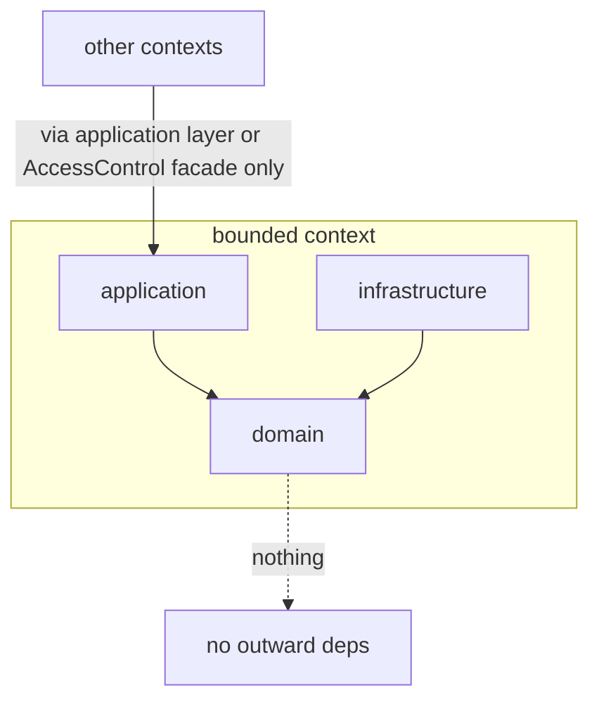
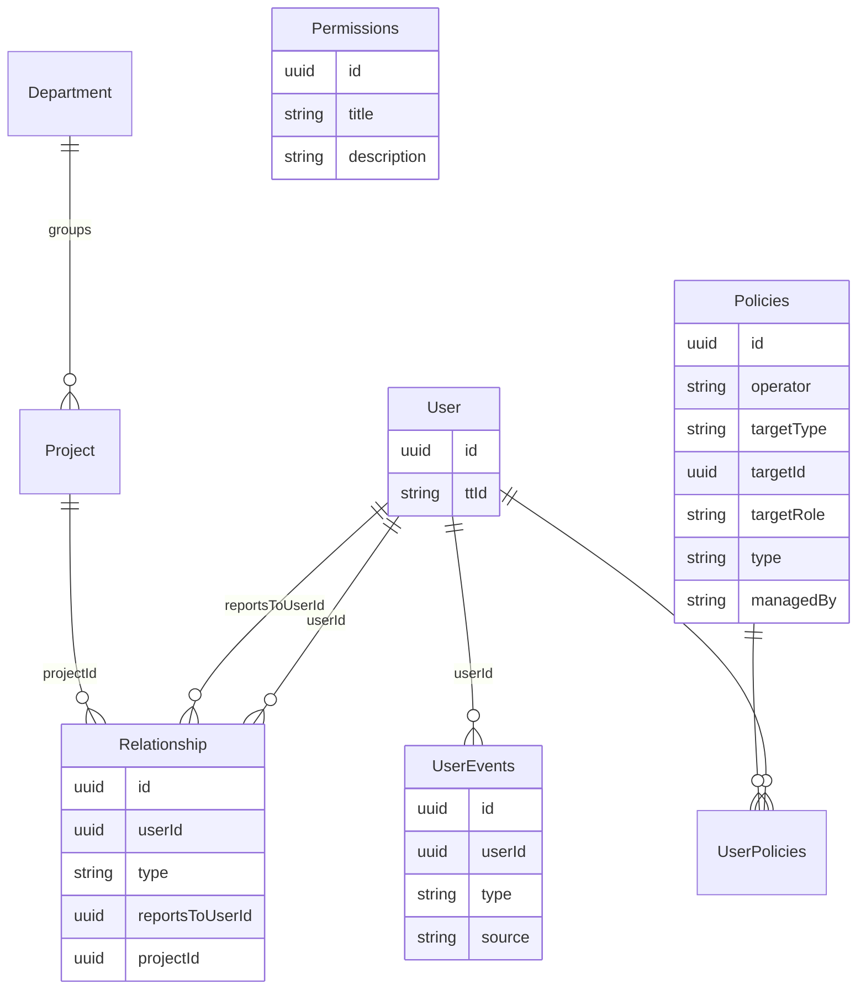

# Architecture Spine — People Management Platform

## Design Paradigm

**Hexagonal (ports & adapters) over DDD bounded contexts.** The backend is a set of bounded contexts; inside each, domain logic depends on nothing but itself. Inbound HTTP is one adapter; persistence and every external system sit behind outbound ports (NestJS DI tokens). Layer → directory mapping per context:

```text
<context-name>/
  application/
    actions/        # use cases
    controllers/    # inbound HTTP adapter
    dtos/           # boundary shapes
  domain/
    interfaces/     # ports (DI token contracts)
    services/       # domain services
    entities/       # rich entities with behavior
  infrastructure/
    *.repository.ts # persistence adapters (Prisma)
    *.adapter.ts    # external-system adapters
```



Dependency rule: `application` and `infrastructure` depend on `domain`; `domain` depends on nothing outside itself. Cross-context calls go through the target context's application layer or the AccessControl facade — never into another context's domain or infrastructure.

## Invariants & Rules

### AD-1 — Three-stage quality gate per feature

- **Binds:** all — every feature, every developer
- **Prevents:** test or production code written against an un-agreed scenario; misunderstandings caught at the expensive stage instead of the cheap one
- **Rule:** (1) scenario/test-case document in `/docs/test-cases/` (line-by-line: actor → request → expected outcome, traced to a requirements section), approved by a developer; (2) E2E test translated from the approved scenario, approved by a developer; (3) only then production code, until that test passes. No production code without a preceding red E2E test in history.

### AD-2 — Hexagonal boundary is absolute

- **Binds:** all backend code
- **Prevents:** domain logic coupling to HTTP, Prisma, or third-party SDKs, which would block fake-backed E2E tests and graceful integration degradation (NFR §7)
- **Rule:** domain code imports nothing from `application/`, `infrastructure/`, NestJS transport, Prisma, or external SDKs. External systems (timetracker, PeopleForce) are outbound ports with adapter implementations.
- **Extended 2026-08-26** (human-flagged in Epic 1 review): the boundary runs both ways. `application/actions/` never `@Inject` a port token directly — only `domain/services/` may hold a port; actions call the domain service. A port interface living in `domain/interfaces/` does not make it safe for `application/` to inject it — full rationale and the one sanctioned exception (auth-gating guards) in `domain-driven-design.md` and `nestjs-di-tokens.md`.

### AD-3 — E2E means real API, faked integrations

- **Binds:** test infrastructure, CI
- **Prevents:** slow/flaky suites blocked by third parties; tests that don't assert what the API actually returns (NFR §7)
- **Rule:** gate-stage-2 tests exercise real HTTP → router → access resolution → real test database. Outbound integration ports are rebound via their DI tokens to fixture-backed fakes in the test module. Live third-party calls in the E2E suite are forbidden.

### AD-4 — The gate is per feature-owner

- **Binds:** team workflow, branching
- **Prevents:** a centralized test-author becoming a serialization point (violates §8.2 mandatory parallelism)
- **Rule:** the feature owner drives their own scenario → test → code sequence; approvals are asynchronous reviews, never a blocking handoff to a dedicated role.

### AD-5 — Bounded contexts with the standard internal layout

- **Binds:** repo structure, team decomposition
- **Prevents:** contexts inventing incompatible layouts; parallel teams colliding in one module
- **Rule:** every context uses the `application/domain/infrastructure` layout from the Design Paradigm. Confirmed contexts: `user-management` (org facts: users, relationships, projects, departments), `access-control` (policies engine, both role dimensions), `dashboards`. Others (profile, resourcing, cds, mentorship, risk, feedback, campaigns, career-timeline) pending confirmation — see Deferred.

### AD-6 — Two role dimensions never collapse (vocabulary invariant)

- **Binds:** all entities, services, method and table names
- **Prevents:** the §2 dimension-collapse mistake entering through naming
- **Rule:** functional roles are assigned: `assignFunctionalRole` / `revokeFunctionalRole` are the only role-mutation methods anywhere. No method, flag, or column ever grants/revokes/stores an access role — access roles (Manager, PP, Colleague, Self tiers) exist only as computed output of tier resolution (AD-10).

### AD-7 — Access control is one policy-attachment engine [ADOPTED]

- **Binds:** access-control context; every context that checks anything
- **Prevents:** per-context role logic; schema changes when new assignable capabilities appear
- **Rule:** AWS-style attachment model. Tables: `Policies {id uuidv7, operator, targetType, targetId (uuid, polymorphic, no DB FK), targetRole, type 'AR'|'FR', managedBy 'sync'|'admin'}`, `Permissions {id uuidv7, title, description}` (granular feature list per §2.3), `UserPolicies {userId, policyId}`. Managerial facts ("Y manages project X") are policy attachments — `Project` carries no `pmUserId`/`dmUserId` and no `users[]` array. FR policies are runtime-editable via HR Admin UI (§2.3); AR policies are seeded by init script and have no UI.

### AD-8 — Operator whitelist; negation barred from access grants

- **Binds:** policies engine
- **Prevents:** fail-open by absent data (a user on no projects satisfies every `!=` condition); non-SQL evaluation on the hot path
- **Rule:** operators start at `==` and `IN`. `!=` is barred from AR/tier-granting rules (FR-scoping/deny-only, if ever needed). Any operator not expressible as an indexed SQL join is barred from tier resolution entirely.

### AD-9 — AccessControl facade is the only authorization entry point

- **Binds:** all contexts
- **Prevents:** `isManager || isPP`-style flag checks scattering across the codebase
- **Rule:** two call shapes, never mixed: `isAllowed(feature)` for FR capability checks (no target), and tier/section checks that always take target-employee scope. Direct policy-table reads or role flags outside the facade are forbidden.

### AD-10 — Tier resolution is bulk, live, and never stored

- **Binds:** access-control context; every list/profile/dashboard endpoint; NFR §7 (500 records / 2 s)
- **Prevents:** per-row graph walks; stale-grant leaks; torn reads; broken compound chains (reports-to *then* project-manager-of)
- **Rule:** one recursive SQL query (`WITH RECURSIVE`) resolves the viewer's tier (Self / Manager-line / PP / Colleague) to all requested employees in a single round trip, walking reports-to edges and manages-**project** policy attachments as **one** transitive graph. **Manages-department is not yet live**: `Policies.targetType:'department'` exists syntactically but the walk does not honor it today — Department edge modeling is still Deferred, and until it resolves, a `department`-targeted policy row contributes nothing to tier resolution (fail-closed default, same treatment as an unwired `mentorship` edge, AD-11/AD-12). The `Relationship` join in this query **filters `type = 'direct'` exclusively** — `project` and `mentorship` rows are never read by the tier walk; `mentorship`'s `reportsToUserId` sharing the column with `direct` (AD-11) does not make it eligible, that column-sharing is a storage-layout fact, not a walk-inclusion rule. Section visibility = tier map joined against the seeded tier→section mapping. The profile single-target check is the degenerate case of the same query. Derived access decisions are never persisted or cached without invalidation-on-graph-change. When a resolution spans the policy query plus a per-`targetType` lookup, both calls run in one transaction. Secondary polymorphic lookups are allowed for feature/audience resolution but barred from the tier hot path.

### AD-11 — Org-fact schema: typed edges, single source of truth

- **Binds:** user-management context, database schema
- **Prevents:** polymorphic FK-less edge columns breaking recursion; membership data drifting between two stores
- **Rule:** `Relationship {id uuidv7, userId FK, type 'direct'|'project'|'mentorship', reportsToUserId FK nullable, projectId FK nullable}` with a CHECK constraint per type — edge types share a table, never a target column, but two edge types (`direct`, `mentorship`) share `reportsToUserId` since both target `User`, the same table — `reportsToUserId` keeps the directional name across both because both point "up" from `userId` to the other party (manager, or mentor), same shape as reports-to. No `roleOnProject`: managerial semantics live in policy attachments (AD-7). At most one active `reportsTo` edge per user (tree, not graph) — this uniqueness does **not** extend to `mentorship` (no sourced one-mentor-at-a-time rule; left unconstrained). Project membership derives solely from `Relationship` rows. Mentor pairing is `type: 'mentorship'`, `userId` = mentee, `reportsToUserId` = the mentor, added via `POST /users/:id/relationships` (AD-14); it carries no start/end columns of its own — attach/detach fires the already-reserved `UserEvents.mentorship_start`/`mentorship_end` (`database-schema.md`), which is where that history lives. A `mentorship` edge grants no access tier unless/until explicitly wired into AD-10's walk (fail-closed default, AD-12). `Relationship` rows are **hard-deleted**, not soft-deleted — no `deletedAt`/`isActive` column, unlike `User`/`UserEvents` in this same schema; "active" in the UNIQUE clause means "row exists," nothing more. No `manager_change` `UserEvents` type is added for this: unlike grade/position/department/mentorship, no concrete consumer of reports-to history is named today — a hard delete simply loses that fact, by design, matching every other org-fact edge (`project`). If reports-to history is ever needed, it's a new, separately-scoped feature request, not a speculative column added now. `UserEvents` writes (system-triggered ones, e.g. `mentorship_start`/`position_change`) happen **synchronously, in the same transaction as the domain mutation that causes them, via an explicit call from that use-case** — no event bus, no generic table-change listener, in iteration 1; every feature owner wiring a new tracked change follows this same one pattern. Dangling policy `targetId`s fail closed (join yields zero members → zero grants); a periodic consistency sweep keeps hygiene.

### AD-12 — Fail-closed everywhere; bootstrap by seeded role

- **Binds:** access-control engine, seed scripts
- **Prevents:** privilege escalation via data glitches; hierarchy position granting functional permissions
- **Rule:** no superuser is ever derived from data shape — an empty `reportsTo` grants nothing; missing/orphaned data always yields *less* access. Top-of-tree gets Manager access purely via the normal transitive walk. The seed script creates the first user with an explicitly assigned HR Admin functional role; all admin power flows through the ordinary FR assignment path, delegable via UI (§2.3).

### AD-13 — External identity now, integrations later

- **Binds:** user-management; future timetracker/PeopleForce sync
- **Prevents:** identity ambiguity across systems (§6); sync-vs-admin write conflicts in the policies table
- **Rule:** `User.ttId` external-identity field exists from day one; managerial policy rows are seed/admin-written until the timetracker integration lands. When it lands: the sync is the sole writer of `managedBy:'sync'` rows and replaces a user's rows transactionally (no old+new coexistence window) — §2.1 non-sticky access depends on it.

### AD-14 — Router tree: no generic sections wrapper; collections, field-groups, and generic attachment endpoints

- **Binds:** every controller in every context; test-case authors binding placeholder URLs to real routes
- **Prevents:** endpoint shapes drifting per feature-owner (already happened before this AD existed: `PUT` vs `PATCH` for the same photo upload, `events` vs `timeline-events` for the same table, functional roles nested under `/users` while every other cross-user resource sat top-level)
- **Rule:** full mapping and rationale in `docs/architecture/api-conventions.md`. Four shapes, never a fifth invented ad hoc: (1) the `User` resource itself — `/users`, `/users/:id` (GET/PATCH/DELETE-as-soft-delete), `PUT /users/:id/photo`, `/users/export` declared **before** `:id` in the controller (literal siblings never lose to a param route); (2) owned collections with real row identity — `/users/:id/<collection>[/:itemId]` (`events`, `documents`, `notes`, `feedbacks`, `assessments`, `idps`, `risks`, `leaves`, `request-history`), or top-level when never user-scoped (`action-items`, `campaigns`, `resourcing/requests`, `share-links`); (3) field-group resources with no row identity — `GET/PATCH /users/:id/<name>` only, no item id, `PATCH` is **full-replace** (omitted fields cleared, not merged — the same semantics for every field-group, no per-owner choice) (`personal-contacts`, `emergency-contacts`, `employment`, `custom-fields` — **router shape only**, the custom-fields *storage* model is still Deferred and may force shape 3 to shape 2 if EAV wins; don't build custom-fields persistence against this shape yet); (4) generic attachment endpoints mirroring AD-7/AD-11 — `POST/DELETE /users/:id/relationships` (`type: 'direct'|'project'|'mentorship'`) and `POST/DELETE /users/:id/policies` (`type: 'AR'|'FR'`) cover every assignable fact instead of a bespoke endpoint per feature; role/permission catalog management is top-level (`GET/POST /roles`, `PATCH /roles/:roleId/permissions`, `DELETE /roles/:roleId`), never nested under `/users`. **Shape-2-vs-shape-3 test for any resource not yet in the table**: shape 2 (collection) iff members can be created or deleted independently without replacing the whole set; shape 3 (field-group) iff cardinality is fixed at one-per-user even when internally multi-field. Adding a resource to either shape is itself an AD-1-gated decision — the api-conventions.md table gets a row before the endpoint is built, not after. Section addressing uses the section's human-readable name (already established by each matrix folder), never the requirements doc's `sNN` id.

## Consistency Conventions

| Concern | Convention |
| --- | --- |
| IDs | `uuidv7` everywhere |
| Naming | contexts kebab-case; NestJS file suffixes (`*.repository.ts`, `*.adapter.ts`, `*.controller.ts`); role methods per AD-6 |
| Ports | domain `interfaces/` + NestJS DI injection token per port; production and test modules bind the same token |
| Auth checks | AccessControl facade only (AD-9) |
| Test cases | `/docs/test-cases/`, each traced to a requirements section (AD-1) |
| HTTP routes | four shapes only — resource, collection, field-group, generic attachment (AD-14, `api-conventions.md`) |

## Stack

| Name | Version |
| --- | --- |
| TypeScript / Node.js | current LTS |
| NestJS | 11.x (do not adopt v12 until GA) |
| Prisma ORM | 7.x |
| PostgreSQL | project standard |

## Structural Seed



## Deferred

- **Custom-field storage model** (EAV vs JSONB) — topic not yet discussed; §4.1/§3.3.5/§6 requirements pending. Do not improvise.
- **Dashboard engine & widget access model** — topic not yet discussed. Do not improvise.
- **Non-manager project assignment semantics** (info-sec-training case) — user clarifying with stakeholders; blocks final Department modeling and possible new `targetRole` values.
- **Profile: own bounded context vs part of user-management** — open question; affects context list in AD-5.
- **Department edge modeling detail** — departments group projects and extend the manager walk upward (generalizing §2.1 relation 2 over a resource tree, not a third relation); exact schema pending the non-manager-assignment answer. **New scope vs requirements doc — flag to requirements owner.**
- **Timetracker & PeopleForce integration design** — API drafts not final; only `ttId` and the single-writer rule (AD-13) are fixed now.
- **Agent rule-loading guarantee** — how `docs/architecture/` is force-loaded into every agent session (candidate: `project-context.md` / AGENTS.md wiring via bmad-project-context).
- **S13 mentorship self-visibility flag's exact endpoint** — inferred as `PATCH /users/:id/relationships/:id` (`api-conventions.md`) since the flag most plausibly lives on the mentorship `Relationship` row; not directly sourced, flag for confirmation when S13 is actually built.
- **S10 leaves / S15 request-history write paths** — no scenario in either test suite exercises a write; only the read route (`GET /users/:id/leaves`, `GET /users/:id/request-history`, AD-14) is fixed. The richer `mentorship` context (pairing status workflow, notifications) beyond the bare pairing fact (now `Relationship.type='mentorship'`, AD-11) is still pending, same as before.
- **`resourcing` context's write path into `Relationship`** — once `resourcing` is confirmed (AD-5), its "request fulfilled → add user to project" flow must go through `user-management`'s application layer (AD-2), never write `Relationship` rows directly. AD-2 already makes this safe if followed; worth an explicit note on that specific seam once `resourcing` lands.
- **`/roles` catalog surface** — AD-14 fixes attachment (`/users/:id/policies`) and now `GET/POST/DELETE /roles` + `PATCH /roles/:roleId/permissions`, but full request/response shapes aren't specified; low risk, AD-1's gate forces this out per-feature when `users/roles/` scenarios are actually built.
- **Operational envelope** (deployment, environments, hosting) — not yet discussed; §9 requires deployed-and-demonstrable, so this must be resolved before first release.
- **Out of scope by iteration-1 constraint:** notifications (§4.13), analytics (§4.14).
