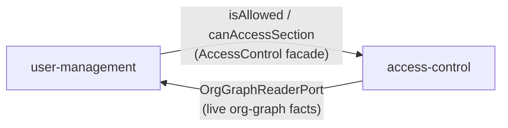
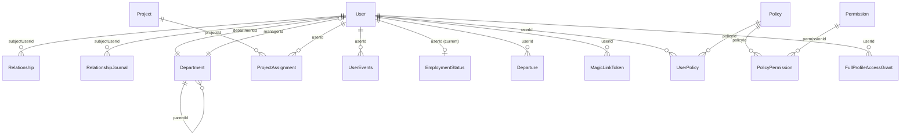

# Architecture Spine — user-management & access-control

## Design Paradigm

Hexagonal (ports & adapters) within DDD bounded contexts. Each context is `src/<context>/{application/{actions,controllers,dtos,guards},domain/{entities,interfaces,services},infrastructure/}`. Domain code depends on nothing outside itself; adapters implement domain-owned port interfaces; NestJS wires ports to adapters as DI tokens. This is the existing repo convention (`services/backend/CLAUDE.md`), reused here because nothing about the stack or the AD-1 red-E2E-before-code gate's testability need has changed.

## Invariants & Rules



### AD-1 — Hexagonal layout, domain purity

- **Binds:** all
- **Prevents:** domain logic entangled with Prisma/NestJS/HTTP, defeating the AD-1-gate testability requirement
- **Rule:** `domain/` imports nothing from `application/`, `infrastructure/`, NestJS transport, Prisma, or SDKs. Only `domain/services/` may inject a port token; `application/actions/` never injects a port directly. [ADOPTED existing repo convention.]

### AD-2 — Cross-context boundary

- **Binds:** user-management, access-control
- **Prevents:** the other context's Prisma models or internal tables being read directly, silently coupling schemas across the boundary
- **Rule:** each context consumes the other only through the target's `application/` exports, never its `domain/` or `infrastructure/`. [ADOPTED existing repo convention.]

### AD-3 — Dependency direction

- **Binds:** both contexts
- **Prevents:** a real cycle where authorization needs data that needs authorization
- **Rule:** two distinct edges, not one: (1) user-management → access-control for authorization — every controller/action calls `AccessControl.isAllowed` / `canAccessSection` before reading or writing; (2) access-control → user-management for org-graph facts, via an `OrgGraphReaderPort` in access-control's domain, implemented by an infrastructure adapter that calls user-management's exported application-layer query service, in-process, live, never cached. **Module-boundary corollary (closes a real NestJS DI cycle the capability-level description alone doesn't prevent):** the query service `OrgGraphReaderPort`'s adapter consumes MUST live in its own module (`UserManagementQueryModule`) with no dependency, direct or transitive, on `AccessControlModule`. `AccessControlModule` imports only that narrow query module, never the controller-bearing `UserManagementModule` — which is the module that imports `AccessControlModule` for its guards. Both edges then terminate in different modules, so neither NestJS module imports the other back.

### AD-4 — Access roles computed live

- **Binds:** access-control
- **Prevents:** a stale permission cache becoming a data leak (§6)
- **Rule:** Self, Reporting line, Project line, PP+HR-line, Colleague are re-derived from source tables on every call. No derived-decision table, no cross-request cache. **Fail-closed on malformed data:** any missing, orphaned, broken, or stale relationship/policy row is treated as absence of the audience or permission it would have granted — never an error, never a default grant.

### AD-5 — Relationship edges (reports-to, people-partner)

- **Binds:** user-management (table + write contract), access-control (reads live)
- **Prevents:** lost updates on concurrent reassignment (the CC-04 write-contract gap)
- **Rule:** `Relationship` entity with `type` discriminator (`direct` | `people_partner`), one row per active edge, at most one active edge per `(subjectUserId, type)` via a partial unique index. Reassignment is DELETE-then-POST (or an atomic replace naming the expected current edge id); a conflicting concurrent write returns `409`. [Extends already-approved DEC-UM-005 (reports-to) to PP by the same shape, resolving CC-04's settled zero-or-one PP cardinality with a CAS-safe contract.]

### AD-6 — Department membership is not a Relationship edge

- **Binds:** user-management (schema), access-control (reads live)
- **Prevents:** blurring two structurally different traversals (person graph vs. department tree) into one query pattern
- **Rule:** `User.departmentId` (exactly one, never null) + `Department.parentId` self-nesting for the tree + `Department.managerId` for who manages it. Cardinality is exactly-one, not zero-or-one, and traversal is a tree walk, not a person-graph walk — the two belong to different shapes. **CAS on write (same guarantee as AD-5, restated because a plain FK has no unique index to enforce it structurally):** writes to `User.departmentId` and `Department.managerId` read the current value with `SELECT ... FOR UPDATE` inside the same transaction as the update and the AD-7 journal insert — or the caller supplies the expected current value and the `UPDATE` is conditioned on it (`WHERE departmentId = :expectedCurrent`); zero rows affected returns `409`. Without this, concurrent reassignment silently loses an update and writes a false before/after pair into the journal.

### AD-7 — Relationship journal

- **Binds:** user-management
- **Prevents:** four different journal shapes for the four access-switch fields, breaking the single-query read the journal (§3.4) promises
- **Rule:** one `RelationshipJournal` table (`actor`, `subjectUserId`, `fieldType` ∈ {manager, people_partner, department, department_manager, full_profile_access}, `beforeValue`, `afterValue`, `timestamp`), written in the same transaction as the field change, regardless of whether the underlying storage is a Relationship edge, a Department/User FK, or a `FullProfileAccessGrant` row (§3.4 requires a full-profile grant/revocation be journaled too; AD-10's `grantedAt`/`revokedAt` columns are audit fields on that table, not the journal itself). **Value encoding, pinned so every `fieldType` writer produces the same shape:** `beforeValue`/`afterValue` are always the raw referenced id (a uuid string, or the literal `null` sentinel for absence) or, for `full_profile_access`, the literal string `granted`/`revoked` — never a denormalized snapshot. Human-readable rendering (names, labels) is resolved by the read side via a join at query time, not stored at write time.

### AD-8 — No self-assignment

- **Binds:** user-management domain services
- **Prevents:** a self-assignment check living only in a controller/guard, bypassable by a future second write path
- **Rule:** every write to manager, people-partner, department, or department-manager is validated in the domain service — never the controller — against the actor's own current entitlement before persisting.

### AD-9 — Functional roles are data

- **Binds:** access-control (owns tables + admin API), user-management (never stores a role flag)
- **Prevents:** `isManager`/`isDM`-style hard-coded role checks anywhere outside access-control
- **Rule:** `Policy` (functional role), `Permission` (fixed catalog), `PolicyPermission` (join), `UserPolicy` (assignment) are persisted data, administrable through a `/roles` API with no deploy and no schema change (§2.3). **Closed catalog, structurally enforced:** `Permission` rows are seeded only from the closed §2.3 feature-permission list; there is no admin-facing create-permission path, and any write attempting to insert a `Permission.name` outside that fixed set is rejected. §2.3 requires *roles* (`Policy`) to be admin-creatable, never `Permission` itself — without this, an admin-created permission like `"view_S2"` could re-implement AD-11's fixed matrix as data. The facade exposes two structurally distinct entry points enforcing the same separation: `isAllowed(actor, functionalPermission)` for feature gates (queries only `Policy`/`Permission`/`UserPolicy`, never returns a section-shaped result) and `canAccessSection(actor, target, section)` for data visibility (queries only the AD-11 matrix constant plus audience resolution) — no controller may substitute one for the other.

### AD-10 — Full profile access is a separate grant

- **Binds:** access-control
- **Prevents:** bundling full-profile access into a functional role (the spec explicitly forbids it), and making "never remove the last holder" unenforceable as a role-permission toggle
- **Rule:** `FullProfileAccessGrant` (`userId`, `grantedBy`, `grantedAt`, `revokedAt`) is independent of `Policy`/`UserPolicy`. The domain service blocks revoking the last active holder and blocks self-grant. **Concurrency guard:** the last-holder check and the revocation execute against a row lock on the active-holder set (`SELECT ... FOR UPDATE` over `FullProfileAccessGrant WHERE revokedAt IS NULL`) within the same transaction as the revoke, so two concurrent revokes serialize instead of both independently seeing count > 1 and both succeeding.

### AD-11 — Two extensibility models

- **Binds:** access-control
- **Prevents:** the fixed, NORMATIVE section matrix accidentally becoming admin-editable by collapsing into the same "everything is a permission row" table as functional roles
- **Rule:** the base section-access matrix (S1–S16 × audience → none/read/write, §3.2) is a versioned code constant in access-control's domain layer, not a DB table. Functional-role permissions (AD-9) ARE DB data. These are two genuinely different extensibility requirements and stay two different mechanisms.

### AD-12 — Project line is a narrowing pass, not a second matrix

- **Binds:** access-control
- **Prevents:** a second full S1–S16 matrix table drifting from the first when one is edited and the other isn't
- **Rule:** Project line (PM/DM of a person's projects, transitively upward through project management only) resolves to a narrower per-section set than Reporting/PP — no S2, no S3, S5 limited to CV+certificates (§3.3.2) — implemented as a narrowing pass applied after base audience resolution. **S7 sub-distinction within Project line** (one of only two documented exceptions to "manager sees everything," §3.3.3): DM resolves to `write`, PM resolves to `read` and only for records flagged `visible for PM` — this is an actor-role split within Project line, not just a section-list narrowing, and belongs to the same pass so it isn't left for an implementer to rediscover from the requirements doc alone.

### AD-13 — PP HR-line reuses the reports-to graph

- **Binds:** access-control
- **Prevents:** a duplicate manager-chain representation for HR that could diverge from the one true reports-to graph
- **Rule:** PP HR-line resolution walks the same `Relationship type='direct'` edges used for Reporting line, starting from the assigned PP and walking upward, filtered to nodes whose `Department.isHrDepartment` is true (§2.1 "restricted to the HR department"). No separate table.

### AD-14 — Audience merge

- **Binds:** access-control
- **Prevents:** two resolver passes silently disagreeing on the same section (one granting write, another denying) with no defined winner
- **Rule:** Self is evaluated first and is exclusive of all manager-derived columns. When an actor simultaneously qualifies for more than one other audience toward the same target, effective per-section access is the best-of merge: write > read > none, evaluated per section independently. [Sourced from the kept facade-audience-resolution SPEC's constraints.]

### AD-15 — Departure scheduling vs. applying

- **Binds:** user-management
- **Prevents:** conflating "scheduled" and "applied" into one status flip, which cannot represent a future effective date
- **Rule:** a `Departure` record (`userId`, `effectiveDate`, `reason`, `recordedBy`, `recordedAt`, `appliedAt` nullable) is written on record-departure (Story 5.1), separate from `EmploymentStatus`. Recording is blocked while the subject still manages anyone/any department or is anyone's PP (§4.16), checked via the same live relationship queries as AD-5/AD-6.

### AD-16 — Departure executor

- **Binds:** user-management
- **Prevents:** a non-idempotent or non-durable effective-date apply (the CC-06 gap)
- **Rule:** a NestJS scheduled task polls for due, unapplied Departures (`effectiveDate <= now() AND appliedAt IS NULL`) using `SELECT ... FOR UPDATE SKIP LOCKED`, and applies the full Story 5.2 side-effect bundle — `EmploymentStatus` closed+reopened as dismissed, open action items cancelled, active mentorship pairs auto-closed with a system note, `User.isActive = false` — plus setting `appliedAt`, all in one transaction per due row. Idempotent by construction: `appliedAt` gates re-selection, so a retry after partial failure (transaction rolled back, `appliedAt` still null) re-attempts the whole bundle cleanly. No new infra — reuses PostgreSQL. **Raw SQL required:** Prisma's typed client has no `SKIP LOCKED` support (open upstream limitation as of Prisma 7) — the claim query MUST be a raw statement (`$queryRaw` inside `$transaction`), not the fluent client API. **Concurrent-human-write guard (prevents the executor from clobbering a real closure note/cancellation reason written moments earlier by a manager, who AD-17 does not block since they aren't themselves departed):** each side-effect statement is a conditional `UPDATE ... WHERE status = 'active'` (or the equivalent per-entity open-state check), never a blind update by id following a prior `SELECT`. A statement affecting zero rows because a human already closed/cancelled the record in the interim is treated as already-satisfied, not re-applied and not overwritten.

### AD-17 — Departure-safe authorization

- **Binds:** access-control
- **Prevents:** a lagging executor granting a window of stale access
- **Rule:** authorization checks treat an actor or target as departed once `Departure.effectiveDate <= now()`, independent of whether `appliedAt` has landed yet — reading the schedule directly, not just the materialized `EmploymentStatus`. This overrides the normal 15-minute project-line revocation window: departure access loss is immediate at the effective date, not next-sync. **Actor vs. target are not symmetric (§4.16 requires read-only, not zero-access, for a departed target's own profile):** a departed **actor** loses all derived access outright — every manager/PP/project-line grant they held over others vanishes. A departed **target**'s profile becomes write-denied for everyone (writes downgrade to `403`/`404` per AD-23) while existing readers' read access is unaffected — the profile is read-only and stays filterable per §4.16, not removed from view.

### AD-18 — Employment status is append-only

- **Binds:** user-management
- **Prevents:** an in-place status update silently destroying the "active" interval's end date, which analytics and the career-record history both need to keep
- **Rule:** `EmploymentStatus` is a time-bounded record per user (`status` ∈ {active, dismissed}, `startDate`, `endDate` nullable) — one open row (`endDate` null) at a time, closed and superseded rather than updated in place. [ADOPTED existing immutable-event-table convention, `services/backend/.claude/rules/nest-prisma.md`.]

### AD-19 — Career-timeline events are written synchronously, in-transaction

- **Binds:** user-management
- **Prevents:** an async listener silently dropping an event on transaction rollback, leaving S9 incomplete
- **Rule:** every system-generated `UserEvents` row is written in the same transaction as the domain mutation that causes it, via an explicit call from that use case's application-layer code — no event bus, no `EventEmitterModule` pub/sub, no generic table-change listener. [Restates the rule already stated inline in the kept `epics.md` for Epic 3.]

### AD-20 — Career-timeline corrections are append, not update

- **Binds:** user-management
- **Prevents:** a corrected event silently erasing what the timeline previously showed, which S9's "full history" requirement and any downstream audit read would then have no record of
- **Rule:** `UserEvents` is append-only; a correction soft-deletes the wrong row (`deletedAt`) and appends a new correct row, never an in-place field update. [ADOPTED existing convention.] A pure delete (§4.9's third verb, no replacement) is the same operation with zero new rows appended — still a soft-delete, never a hard delete, so the removed entry stays reconstructable.

### AD-21 — Two token kinds

- **Binds:** user-management (auth flow), access-control (reads the JWT's `userId`, does not otherwise interpret it)
- **Prevents:** a single token type forced to satisfy two incompatible needs — server-revocable single-use for login, and cheap stateless verification for every subsequent request
- **Rule:** (1) magic-link token — opaque random value, hashed at rest, DB-backed (`MagicLinkToken`: `userId`, `tokenHash`, `expiresAt`, `consumedAt`, `dispatchStatus` ∈ {pending, sent, failed}), single-use — replay-prevention (DEC-UM-004) needs server-side state a stateless token can't provide, and `dispatchStatus` satisfies DEC-UM-008's requirement that dispatch be durably tracked as pending/failed and retryable rather than an unstated side effect; (2) session/access token — stateless signed JWT (`userId`, `issuedAt`, expiry), issued only after successful magic-link consumption, no server-side session table. Re-authentication is a fresh magic-link request; no refresh-token flow in scope.

### AD-22 — Enumeration safety

- **Binds:** user-management
- **Prevents:** a caller inferring account existence or employment status from response-shape or timing differences (account-enumeration leak)
- **Rule:** `POST /auth/magic-link` returns an identical `200` body shape and dispatches zero email for an unknown OR a deactivated/dismissed `workEmail`, exactly as for a known active one. **Scheduled-not-yet-applied departure counts too:** the same check additionally treats a `workEmail` as inactive when a `Departure` row exists with `effectiveDate <= now()`, regardless of whether AD-16's executor has set `appliedAt` yet — the request/consume flow uses AD-17's live departure check, not only the materialized `User.isActive`/`EmploymentStatus`, so a scheduled departure can't complete a login in the executor's gap window. [ADOPTED, DEC-UM-004; DEC-UM-012 tagged draft by its own source (`user-management-test-decisions.md`) pending PO confirmation as of 2026-08-25 — apply it, but flag it as unconfirmed rather than settled if a story owner asks.]

### AD-23 — Denial convention

- **Binds:** both contexts, every controller
- **Prevents:** two controllers choosing different status codes for the same denial class, which would make a `—` cell leak-detectable by status code alone
- **Rule:** `401` missing/invalid token; `403` valid token but missing functional permission, or a write against read-only access; `404` for a no-access section or hidden field (never reveals it exists); absent payload data is a missing key, never `null`. [ADOPTED, already-approved in the kept access-control test-case README and facade SPEC.]

### AD-24 — Query cost budget

- **Binds:** access-control
- **Prevents:** an N+1 application-side traversal or an unindexed recursive scan silently blowing the 500-record/2-second budget as the population grows
- **Rule:** every graph traversal (reports-to walk, department-tree walk, project-assignment lookup, PP HR-line walk) is one indexed query per graph per request; empty target-set input performs zero queries; one request's policy/target reads share a single transaction. `reportsToUserId`, `departmentId` (on `User` and `Department.parentId`), and project-assignment foreign keys are indexed; recursive resolution uses a recursive CTE, not N+1 application-side loops. Supports the 500-record/2-second §7 NFR jointly with user-management's list endpoint.

### AD-25 — API routes

- **Binds:** both contexts
- **Prevents:** an organisational-relationship change slipping through the general-purpose S1 `PATCH`, bypassing AD-8's self-assignment check and AD-7's journal write
- **Rule:** resource root `/users` (`GET` list, `GET :id`, `PATCH :id` for S1 writes, `PUT :id/photo`, `GET`/`POST :id/events`, no `POST /users` — seed/import only); a dedicated relationships endpoint for manager/PP/department changes, never through the S1 `PATCH`; `/departments` for department CRUD (§4.17, the *manage departments* permission — distinct from changing a person's department, which goes through the relationships endpoint); `/auth/magic-link` and `/auth/magic-link/consume`; `/roles` for the functional-role catalog. No `/sections/:sN` wrapper — every resource addressed directly. [ADOPTED, restates already-approved language from the kept test-case READMEs.]

### AD-26 — Career-timeline manual-write scope narrower than base S9

- **Binds:** user-management
- **Prevents:** a story built straight from the base matrix (S9 = RW for Reporting line and PP) granting manual timeline-write to the full transitive Reporting line, contradicting an already-approved, currently-binding decision
- **Rule:** manual add/edit/delete of `UserEvents` is restricted to the target's assigned PP and direct Unit Manager only; transitive/project-derived managers hold S9 read only, never manual write, regardless of the base matrix's RW cell for read. [ADOPTED, DEC-UM-001 — read follows the base matrix (full Reporting line + PP); manual write is the narrower §4.9 rule.]

### AD-27 — Full profile access resolves to a read override, not a write override

- **Binds:** access-control
- **Prevents:** two independently-plausible readings of §2.4 ("bypass the matrix entirely, RW every section" vs. "widen only Colleague-level sections") producing genuinely different behavior for the same grant
- **Rule:** a `FullProfileAccessGrant` holder resolves to `read` for every section (S1–S16) unconditionally, overriding the base matrix's per-audience read gating and Self-exclusivity alike. It does **not** widen write access beyond whatever the holder's own relationship-derived audience and functional permission already allow — §2.4 describes a grant to *see*, not a blanket editing right, and nothing in §2.4 states a write widening. Full profile access is not itself a matrix column; it is a read-override layer applied after normal audience/matrix resolution (AD-14).

### AD-28 — Deployment envelope (minimum answer to close an otherwise-silent dimension)

- **Binds:** both contexts
- **Prevents:** two epics independently assuming different deployment shapes (single long-lived process vs. horizontally-scaled containers) with nothing forcing agreement — concretely relevant to AD-16, whose `SKIP LOCKED` design is safe under multiple concurrent instances but says nothing about whether that's the actual deployment target
- **Rule:** single container, single application instance, PostgreSQL as a separate container (already true locally per `docker-compose`) — `SKIP LOCKED` is chosen so this can later scale to multiple instances without an AD-16 redesign, but scaling itself, environment strategy (dev/staging/prod), provider choice, and operational monitoring are not decided here. [Deferred beyond this minimum — see Deferred.]

## Consistency Conventions

| Concern | Convention |
| --- | --- |
| Naming (entities, files) | snake_case tables via `@@map`, camelCase TS fields — existing `nest-prisma.md` convention |
| Ids | `uuidv7`, primary keys only |
| Audit columns | added per-table only for a named consumer, never speculatively — existing `nest-prisma.md` convention |
| Event/log tables | immutable — append + soft-delete-and-replace, never in-place update (AD-20, AD-18) |
| State & cross-cutting | authorization exclusively through the AccessControl facade (AD-3); no controller reads a policy table or role flag directly |
| Errors | leak-safe status convention (AD-23) |

## Stack

| Name | Version |
| --- | --- |
| NestJS | 11 (Express, CommonJS) |
| Prisma | 7, with `@prisma/adapter-pg` |
| PostgreSQL | 18 |
| Node | >=24 |
| Test | Jest + Supertest (e2e) |

[ADOPTED — existing infra investment in `services/backend` (`storage/`, `prisma/`, `config/`, `modules/health/`), untouched by the 2026-08-30 reset. Not re-verified since nothing about the stack is being reconsidered.]

## Structural Seed

```text
src/
  user-management/
    application/{actions,controllers,dtos,guards}/   # magic-link auth, S1 CRUD, relationships, departure, events
    domain/{entities,interfaces,services}/            # User, Relationship, Department, Departure, EmploymentStatus, UserEvents
    infrastructure/                                   # Prisma repositories, MagicLinkToken store, departure-executor scheduled task
  access-control/
    application/{actions,controllers,dtos}/           # AccessControl facade entry points, /roles admin API
    domain/{entities,interfaces,services}/            # Policy, Permission, FullProfileAccessGrant, audience-resolution service, OrgGraphReaderPort
    infrastructure/                                   # Prisma repositories, OrgGraphReaderAdapter (calls user-management's application layer)
  storage/                                            # pre-existing, out of scope for this redesign
  prisma/, config/, modules/health/                   # pre-existing shared infra, out of scope
```



## Capability → Architecture Map

| Capability / Area | Lives in | Governed by |
| --- | --- | --- |
| CAP-1 Authorization facade (facade-audience-resolution SPEC) | `access-control/application` | AD-3 |
| CAP-2 Phase 1 audience resolution (Self/Reporting/PP/Colleague, + Project line structurally) | `access-control/domain` | AD-4, AD-5, AD-6, AD-12, AD-13, AD-14, AD-24 |
| CAP-3 Functional permission decision | `access-control` Policy/Permission/UserPolicy | AD-9 |
| CAP-4 Base section access | `access-control/domain` matrix constant | AD-11, AD-12 |
| CAP-5 Departure-safe authorization | `access-control` + `user-management` Departure | AD-15, AD-16, AD-17 |
| CAP-1/CAP-2 (audience-foundation SPEC, Phase-0) | superseded by the above — same mechanics, narrower prior slice | AD-4, AD-5 |
| Full profile access × section matrix (facade SPEC open question) | `access-control` | AD-10, AD-27 |
| Epic 1 Employee Record Management | `user-management` | AD-1, AD-2, AD-23, AD-25 |
| Epic 2 Magic-Link Authentication | `user-management` | AD-21, AD-22 |
| Epic 3 Career Timeline | `user-management` | AD-19, AD-20, AD-26 |
| Epic 4 Organizational Relationships (incl. CC-04) | `user-management` | AD-5, AD-6, AD-7, AD-8 |
| Epic 5 Employment Lifecycle (incl. CC-06) | `user-management` | AD-15, AD-16, AD-17, AD-18 |

## Deferred

- **Other bounded contexts:** dashboards, resourcing, risks, feedback, CDS, mentorship-as-a-persisted-context (Epic 4's own handoff note already defers this), campaigns, notifications, analytics, custom-fields storage engine, PeopleForce integration — none created, matching prior scoping and the user's explicit out-of-scope instruction for this reset.
- **Shared-link overlay (§4.8):** not designed here; a future extension of the access-control facade once user-management/profile-sharing surfaces exist.
- **Project-line positive grants — implementation timing:** this spine fixes the *structure* (AD-12); whether it ships alongside Reporting/PP in the same sprint is a `sprint-status.yaml` staging decision, not architecture.
- **`Department.isHrDepartment` provenance:** [ASSUMPTION] the seeded population/department import sets this marker for exactly the HR department(s); not settled by any kept artifact. Confirm before building AD-13's HR-line filter.
- **Exact per-endpoint AccessControl call sequence** (the "UM integration contract" question the kept audience-foundation SPEC left open): AD-25 fixes the route shapes; the precise call sequence is `bmad-spec`/`bmad-build` implementation detail, not a spine-level decision.
- **`Project`/`ProjectAssignment` persistence and timetracker sync (§5.1):** used structurally by AD-12/AD-24 and the ER diagram, but ownership, the event-vs-state-at-sync-time question, the 15-minute freshness mechanism, and the 4-hour degraded-mode withdrawal are not designed here. An owning context (or a new one) is picked when Project-line's positive-grant implementation is scheduled — see the Project-line staging entry above.
- **Deployment beyond AD-28's minimum:** environment strategy (dev/staging/prod), provider/infra choice, and operational monitoring for the AD-16 scheduled task are not decided; AD-28 fixes only the instance-count assumption AD-16's design leans on.
- **`docs/architecture/access-control.md` dangling companion references:** both access-control SPEC.md kernels' `companions:` still name this now-deleted file; reconciling their frontmatter to point at this spine is pending (noted, not blocking — the content itself was already re-derived here).
