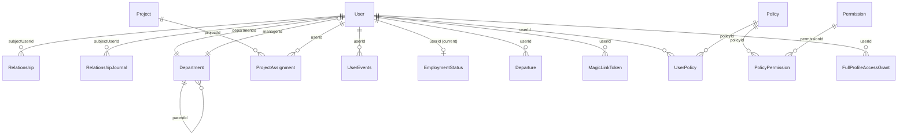

# Database Schema — Core Tables

Binding shapes for the org-fact, lifecycle, and access-control tables. Spine: [architecture-people-management-2026-08-30/ARCHITECTURE-SPINE.md](../../_bmad-output/planning-artifacts/architecture/architecture-people-management-2026-08-30/ARCHITECTURE-SPINE.md) AD-5 through AD-11, AD-15, AD-16, AD-18 through AD-21, AD-26, AD-27. Prisma models must match these shapes; deviations go through the architect.

## Conventions

- All primary keys: `uuidv7`.
- PostgreSQL; Prisma ORM 7.x is the only persistence layer, and it lives exclusively in `infrastructure/`.
- Audit columns are added per-table only when there's a concrete, named consumer — not speculatively. See `services/backend/.claude/rules/nest-prisma.md` for the full modeling convention (this is the single source of truth for it — not duplicated here).
- Event/log tables are immutable: a correction soft-deletes the wrong row and appends a new one, never an in-place update.

## Entity relationships

## Tables

### User

Identity-card fields (S1): `firstName`, `lastName`, `photo`, `position`, `country`, `city`, `workEmail` (unique, normalized), `workPhone`, `birthDay`/`birthMonth` (no year), `companyJoinDate`, `isActive`, `ttId` (unique, nullable), `departmentId` (FK, exactly one, never null). No `POST /users` — seed/import only.

### Relationship (AD-5)

`type` ∈ {`direct` (reports-to), `people_partner`}, `subjectUserId`, `holderUserId`, active-edge partial unique index on `(subjectUserId, type)`. Reassignment: DELETE-then-POST or atomic replace naming the expected current edge id; conflicting concurrent write → `409`.

### Department (AD-6)

`parentId` (self-nesting tree), `managerId` (FK to `User`), `isHrDepartment` (bool — see spine Deferred for provenance). Writes to `Department.managerId` and `User.departmentId` use the same CAS discipline as `Relationship` (`SELECT ... FOR UPDATE` or expected-current-value conditional update; zero rows affected → `409`).

### RelationshipJournal (AD-7)

`actor`, `subjectUserId`, `fieldType` ∈ {`manager`, `people_partner`, `department`, `department_manager`, `full_profile_access`}, `beforeValue`/`afterValue` (raw id or `null`/`granted`/`revoked` — never a denormalized snapshot), `timestamp`. Written in the same transaction as the field change.

### Policy / Permission / PolicyPermission / UserPolicy (AD-9)

Functional roles as data. `Permission` is a closed catalog seeded only from the §2.3 list — no admin-facing create-permission path. `Policy` (the role) and `UserPolicy` (assignment) are admin-creatable via `/roles`.

### FullProfileAccessGrant (AD-10, AD-27)

`userId`, `grantedBy`, `grantedAt`, `revokedAt`. Domain service blocks revoking the last active holder (row-locked check) and blocks self-grant. Resolves to unconditional `read` on every section at authorization time — write stays governed by the holder's own relationship-derived audience.

### Departure / EmploymentStatus (AD-15, AD-16, AD-18)

`Departure`: `userId`, `effectiveDate`, `reason`, `recordedBy`, `recordedAt`, `appliedAt` (nullable — gates the executor's idempotency). `EmploymentStatus`: append-only, one open row (`endDate` null) at a time, `status` ∈ {active, dismissed}.

### UserEvents (AD-19, AD-20, AD-26)

`userId`, `type`, `source` ∈ {system, manual}, `eventDate`, `details` (jsonb), `createdBy`, `createdAt`, `deletedAt` (nullable). Written synchronously in the same transaction as the causing mutation. Manual write restricted to the target's assigned PP and direct Unit Manager only (narrower than the base S9 read audience).

### MagicLinkToken (AD-21)

`userId`, `tokenHash`, `expiresAt`, `consumedAt`, `dispatchStatus` ∈ {pending, sent, failed}. Opaque, single-use, hashed at rest.
