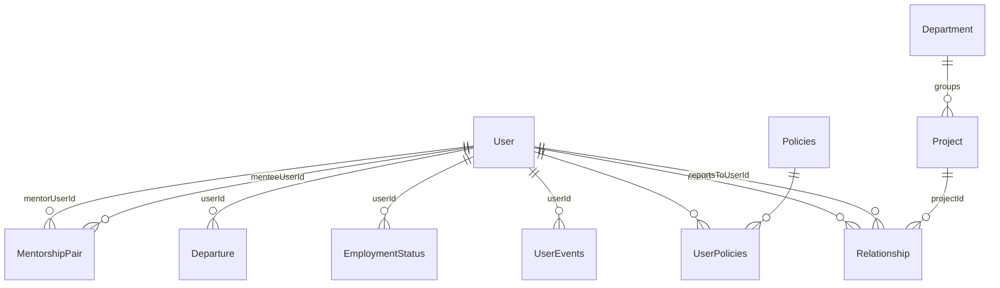

# Database Schema — Core Tables

Binding shapes for the org-fact, lifecycle, mentorship, and access-control tables. Spine: AD-7, AD-11, AD-16, AD-17, AD-19, AD-20. Prisma models must match these shapes; deviations go through the architect.

## Conventions

- All primary keys: `uuidv7`.
- PostgreSQL; Prisma ORM 7.x is the only persistence layer, and it lives exclusively in `infrastructure/` (see [domain-driven-design.md](domain-driven-design.md)).
- Audit columns (`updatedAt`, `updatedBy`, etc.) are added per-table only when there's a concrete, named consumer — not speculatively "just in case". A real change-history/audit-log is a separate, deliberately-scoped feature, not a default add-on.

## Entity relationships



## Tables

### User

Identity and profile root, owned by `user-management` ([PRD](../../_bmad-output/planning-artifacts/prds/prd-user-management-2026-08-20/prd.md)). Carries `ttId` (timetracker external identity, AD-13) from day one — email alone is not sufficient identity across systems (§6). **Never** carries role flags, manager pointers, project references, department references, or any other access-derived field — those are derived from `Relationship` (AD-11) and pending Department/Policy edges, not stored here.

```text
User {
  id              uuidv7 PK
  firstName       string
  lastName        string
  photo           string, nullable
  position        string
  country         string
  city            string
  workEmail       string, unique
  workPhone       string, nullable
  birthDay        int, nullable          // 1-31. §3.2 S1 content is literally "birthday (day and month)" -- no year is ever captured or stored, for any audience. Replaces the earlier single full-date `birthDate` design (2026-08-25 product decision: that design invented an audience-based year-redaction rule the source never states)
  birthMonth      int, nullable          // 1-12, paired with birthDay -- both null together or both set together
  companyJoinDate date
  isActive        boolean, default true  // technical account/row-retention flag; never employment status (AD-16)
  ttId            string, nullable, unique
  customFields    jsonb, default '{}'   // interim only; final storage remains open in custom-fields.md
  createdAt       timestamp
  createdBy       FK -> User
}
```

No `updatedAt`/`updatedBy` — see Conventions above; nothing here consumes a last-touch marker.

Derived, not stored: current manager, project(s), and People Partner read through `Relationship` (below); department reads through the pending Department/Policy edge model; mentor reads through `MentorshipPair`.

Users are loaded only by the idempotent seeded-population import (AD-16). No request-level employee-creation API owns this table.

### EmploymentStatus (AD-16)

Employment status is a temporal S4 fact, not `User.isActive` and not a career-timeline event:

```text
EmploymentStatus {
  id              uuidv7 PK
  userId          FK -> User
  status          'active' | 'dismissed'
  validFrom       date
  validTo         date, nullable
  departureReason string, nullable
  sourceDepartureId FK -> Departure, nullable, unique
}
UNIQUE: at most one row per user with validTo IS NULL
CHECK: (status='active' AND sourceDepartureId IS NULL AND departureReason IS NULL)
    OR (status='dismissed' AND sourceDepartureId IS NOT NULL AND departureReason IS NOT NULL)
```

Intervals are half-open `[validFrom, validTo)`: applying departure closes the current `active` row at `effectiveDate` and inserts `dismissed` from that same date. `sourceDepartureId` makes the materialized fact idempotent. There is deliberately no `departure`/`leaving` `UserEvents` type.

### Departure (AD-20)

The scheduled command and worker state are separate from the applied employment fact:

```text
Departure {
  id                 uuidv7 PK
  userId             FK -> User
  effectiveDate      date
  effectiveTimeZone string
  dueAt              timestamptz
  reason             string
  state              'scheduled' | 'processing' | 'retry_wait' | 'applied'
  idempotencyKey     uuid, unique
  requestHash        string
  attempts           int, default 0
  lastError          string, nullable
  nextAttemptAt      timestamptz, nullable
  leaseUntil         timestamptz, nullable
  leaseToken         uuid, nullable
  appliedAt          timestamptz, nullable
  createdAt          timestamptz
  createdBy          FK -> User
}
UNIQUE: one non-applied Departure per user
```

At creation, the required startup-validated IANA setting `BUSINESS_TIME_ZONE` is snapshotted to `effectiveTimeZone` and `dueAt` is resolved once for `00:00`; every guard/worker compares stored `dueAt` with PostgreSQL time and never falls back to host/runtime local time. `requestHash` canonically includes endpoint version, user id, normalized ISO effective date, normalized reason, and creator id; replay rechecks current authorization before returning the original result. Key reuse with a different hash is `409`. The partial non-applied uniqueness and state machine use raw-SQL constraints where Prisma cannot express them. Workers claim eligible rows in stable `effectiveDate,id` order with skip-locked selection and a fresh `leaseToken`; apply/fail/reclaim locks the row and predicates on that token, so an expired/reclaimed worker cannot commit stale work. There is no terminal abandoned state.

The apply transaction closes/inserts `EmploymentStatus`, deactivates the account/profile, cancels open action items, system-closes mentorship pairs, ends persisted access held by the actor, and marks the Departure applied. Every effect is keyed or constrained by `Departure.id` so uncertain-commit retries cannot duplicate it. Recording is blocked by any active v1.5 manager or PP responsibility; after scheduling, new such assignments are rejected or quarantined. Legacy blockers produce an authorized remediation incident but never delay effective access cutoff. Cancellation/rescheduling are not defined.

### UserEvents

The §4.9 career-timeline log, folded into `user-management` (see [domain-driven-design.md](domain-driven-design.md)). System-written on tracked changes; PP and UM may also add or soft-delete entries manually. An event is an immutable fact, not a mutable record — §4.9's "edit... events the system inferred wrongly" is modeled as soft-deleting the wrong entry and appending a corrected one, never an in-place field update. No `updatedAt`/`updatedBy` as a result (see Conventions).

```text
UserEvents {
  id        uuidv7 PK
  userId    FK -> User
  type      string; // e.g. 'joined_company' | 'grade_change' | 'position_change'
          | 'department_change' | 'employment_type_change'
          | 'extended_leave' | 'mentorship_start' | 'mentorship_end'
  eventDate date
  details   jsonb                  // type-specific metadata, e.g. grade_change: {from, to}
  source    'system' | 'manual'
  deletedAt timestamp, nullable    // soft delete -- e.g. superseding a wrongly-inferred event
  createdAt timestamp
  createdBy FK -> User
}
```

`department_change`'s payload fields reference Department ids once the Department edge contract lands. `mentorship_start`/`mentorship_end` are fired by `MentorshipPair` transitions (AD-17).

### Relationship (AD-11)

The org-fact edge table — the input the tier-resolution walk recurses over.

```text
Relationship {
  id            uuidv7 PK
  userId        FK -> User        // who this edge is about
  type          'direct' | 'project' | 'people_partner'
  reportsToUserId FK -> User, nullable    // set iff type = 'direct' or 'people_partner'
  projectId     FK -> Project, nullable // set iff type = 'project'
}
CHECK: (type='direct' AND reportsToUserId IS NOT NULL AND projectId IS NULL)
    OR (type='project' AND projectId IS NOT NULL AND reportsToUserId IS NULL)
    OR (type='people_partner' AND reportsToUserId IS NOT NULL AND projectId IS NULL)
CHECK: userId <> reportsToUserId
UNIQUE: one reportsTo edge per userId (type='direct' only — the reporting relation is a tree)
UNIQUE: one People Partner edge per userId (type='people_partner' only)
-- "active" means the row exists: Relationship rows are hard-deleted (see Rules), no deletedAt/isActive column
```

Rules:

- Edge types share the table but never a polymorphic target column: `direct` and `people_partner` point to `User` through `reportsToUserId`; `project` points to `Project` through `projectId`. This keeps AD-10's audience walks indexable.
- No `roleOnProject` field — managerial semantics live in policy attachments (AD-7).
- Project membership derives **solely** from these rows. `Project` holds no member array; a project's members are `SELECT userId FROM Relationship WHERE projectId = :id`.
- **`DELETE` is a hard delete**, for all types. The §3.4 narrow journal, not this table, retains required organisational-change evidence. Mentorship is not stored here (AD-17).
- `people_partner` uses atomic expected-current `PUT`/`DELETE` semantics (AD-19); generic second-create behavior is not its replacement contract.
- **Migration note (rechecked 2026-08-29):** Prisma 7 can express partial indexes only through the `partialIndexes` Preview feature, which this repository does not enable; PostgreSQL `CHECK` constraints remain database-enforced. Keep this project on explicit raw SQL for these constraints unless a separate reviewed decision enables that Preview feature.

### Project / Department

Plain records. `Department` is a first-class nested entity; every employee has exactly one current department. It routes resourcing requests, keys CDS matrix lookup together with position, and a membership change writes `department_change` to `UserEvents`. No separate Unit entity exists. Projects have no `pmUserId`, `dmUserId`, or `users[]`; managerial facts are policy attachments and membership is `Relationship`.

Exact indexed Department membership/parent/manager edge shapes remain an explicit follow-up contract (spine Deferred). `Policies.targetType:'department'` is not honored by AD-10 until that contract is approved; the interim is fail-closed.

### MentorshipPair (AD-17)

```text
MentorshipPair {
  id           uuidv7 PK
  mentorUserId FK -> User
  menteeUserId FK -> User
  status       'active' | 'ended'
  startDate    date
  endDate      date, nullable
  closureNote  string, nullable
  closedBy     FK -> User, nullable
}
```

Normal transition to `ended` requires `closureNote`; departure auto-close writes a system note and bypasses that manual gate. Ended rows are retained. Start/end writes `mentorship_start`/`mentorship_end` `UserEvents` in the same transaction. Pair rows never participate in access resolution. The open-to-mentoring flag is a separate unresolved profile fact; clearing it must not alter active rows.

### Policies (AD-7)

```text
Policies {
  id         uuidv7 PK
  operator   '=='                 // policy-level IN deferred; do not add a set representation yet
  targetType 'project' | 'department' | 'user' | ...
  targetId   uuid                  // polymorphic — NO db-level FK, by design
  targetRole string                // e.g. 'ac-manager', 'project-manager'
  type       'AR' | 'FR'
  managedBy  'sync' | 'admin'      // provenance; sync rows owned by integration only
}
```

- `targetId` has no FK because `targetType` selects the table. Consequences are accepted and handled: dangling ids fail closed on the AR path (zero joined members → zero grants); a periodic consistency sweep removes orphans; any resolution spanning the policy query plus a per-`targetType` lookup runs in **one transaction** (AD-10).

### Permissions

```text
Permissions {
  id          uuidv7 PK
  title       string   // e.g. 'create-resourcing-requests', 'assign-mentors'
  description string
}
```

The granular feature list of §2.3 — each independently grantable.

### UserPolicies

```text
UserPolicies {
  userId   FK -> User
  policyId FK -> Policies
}
```

Attachment join — one policy row shareable across many users.

## What is deliberately absent

- Any stored access-role/tier/permission result (AD-10: derived access is never persisted).
- Custom-field tables — storage model not yet decided ([custom-fields.md](custom-fields.md)).
- Other profile-section tables — pending the Profile bounded-context decision (spine Deferred).
