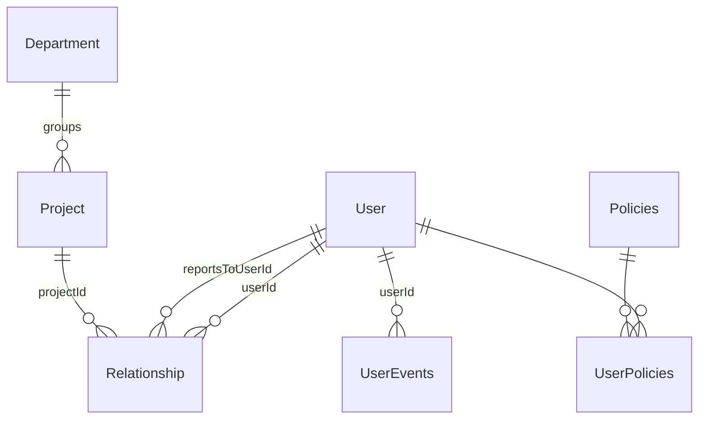

# Database Schema — Core Tables

Binding shapes for the org-fact and access-control tables. Spine: AD-7, AD-11. Prisma models must match these shapes; deviations go through the architect.

## Conventions

- All primary keys: `uuidv7`.
- PostgreSQL; Prisma ORM 7.x is the only persistence layer, and it lives exclusively in `infrastructure/` (see [domain-driven-design.md](domain-driven-design.md)).
- Audit columns (`updatedAt`, `updatedBy`, etc.) are added per-table only when there's a concrete, named consumer — not speculatively "just in case". A real change-history/audit-log is a separate, deliberately-scoped feature, not a default add-on.

## Entity relationships



## Tables

### User

Identity and profile root, owned by `user-management` ([PRD](../../_bmad-output/planning-artifacts/prds/prd-user-management-2026-08-20/prd.md)). Carries `ttId` (timetracker external identity, AD-13) from day one — email alone is not sufficient identity across systems (§6). **Never** carries role flags, manager pointers, project references, department references, or any other access-derived field — those are derived from `Relationship` (AD-11) and pending Department/Policy edges, not stored here.

```text
User {
  id              uuidv7 PK
  firstName       string
  lastName        string
  photo           string, nullable
  position        string
  country         string
  city            string
  workEmail       string, unique
  workPhone       string, nullable
  birthDate       date, nullable         // full date stored; §3.2 display shows day+month only for non-privileged audiences
  companyJoinDate date
  isActive        boolean, default true  // soft delete
  ttId            string, nullable, unique
  customFields    jsonb, default '{}'   // interim, ahead of the dynamic custom-fields system (custom-fields.md); DEC-UM-003
  createdAt       timestamp
  createdBy       FK -> User
}
```

No `updatedAt`/`updatedBy` — see Conventions above; nothing here consumes a last-touch marker.

Derived, not stored: current manager and project(s) read through `Relationship` (below); people partner is a policy attachment (AD-7) — an access role per §2.1, same treatment as manager; department reads through the pending Department/Policy edge model; mentor reads through the future `mentorship` context's pair records.

### UserEvents

The §4.9 career-timeline log, folded into `user-management` (see [domain-driven-design.md](domain-driven-design.md)). System-written on tracked changes; PP and UM may also add or soft-delete entries manually. An event is an immutable fact, not a mutable record — §4.9's "edit... events the system inferred wrongly" is modeled as soft-deleting the wrong entry and appending a corrected one, never an in-place field update. No `updatedAt`/`updatedBy` as a result (see Conventions).

```text
UserEvents {
  id        uuidv7 PK
  userId    FK -> User
  type      string; // e.g. 'joined_company' | 'grade_change' | 'position_change'
          | 'department_change' | 'employment_type_change'
          | 'extended_leave' | 'mentorship_start' | 'mentorship_end'
  eventDate date
  details   jsonb                  // type-specific metadata, e.g. grade_change: {from, to}
  source    'system' | 'manual'
  deletedAt timestamp, nullable    // soft delete -- e.g. superseding a wrongly-inferred event
  createdAt timestamp
  createdBy FK -> User
}
```

`department_change`'s payload fields will reference Department ids from a context that doesn't exist yet — reserved, unpopulated until it lands (same treatment as `User.ttId`). `mentorship_start`/`mentorship_end` now have a home: fired by `Relationship.type='mentorship'` attach/detach (see `Relationship` below) — no longer waiting on a future context.

### Relationship (AD-11)

The org-fact edge table — the input the tier-resolution walk recurses over.

```text
Relationship {
  id            uuidv7 PK
  userId        FK -> User        // who this edge is about
  type          'direct' | 'project' | 'mentorship'
  reportsToUserId FK -> User, nullable    // set iff type = 'direct' (reports-to) or 'mentorship'
  projectId     FK -> Project, nullable // set iff type = 'project'
}
CHECK: (type='direct' AND reportsToUserId IS NOT NULL AND projectId IS NULL)
    OR (type='project' AND projectId IS NOT NULL AND reportsToUserId IS NULL)
    OR (type='mentorship' AND reportsToUserId IS NOT NULL AND projectId IS NULL)
UNIQUE: one active reportsTo edge per userId (type='direct' only — the reporting relation is a tree; NOT extended to 'mentorship', no sourced one-mentor-at-a-time rule)
-- "active" means the row exists: Relationship rows are hard-deleted (see Rules), no deletedAt/isActive column
```

Rules:

- Edge types share the table but **never** a target column keyed by target *table* — `direct` and `mentorship` share `reportsToUserId` (kept, not renamed, precisely because both are the same directional shape: `userId` points "up" to `reportsToUserId` — the manager, or the mentor) because both point at `User`; `project` gets its own FK because it points at a different table. This single-table-no-per-type-column layout is what makes the table AD-10's tier walk can index cheaply — **but the walk itself still only reads `type='direct'` rows** (`access-control.md`); sharing a column is a storage fact, not a signal that `mentorship` participates in the recursive query.
- No `roleOnProject` field — managerial semantics live in policy attachments (AD-7).
- Project membership derives **solely** from these rows. `Project` holds no member array; a project's members are `SELECT userId FROM Relationship WHERE projectId = :id`.
- `type='mentorship'` carries no start/end columns of its own — attach/detach (`POST`/`DELETE /users/:id/relationships`, [api-conventions.md](api-conventions.md)) fires the matching `UserEvents.mentorship_start`/`mentorship_end` row (already reserved below), which is where that history lives. `userId` is the mentee, `reportsToUserId` is the mentor — same directional reading as `direct`. A `mentorship` edge grants no access tier unless/until explicitly wired into the AD-10 walk (fail-closed default, AD-12).
- **`DELETE` is a hard delete**, for every type. No `deletedAt`/`isActive` column here, unlike `User`/`UserEvents` above — a revoked reports-to/project/mentorship edge is simply gone, and no `manager_change` `UserEvents` type exists to recover that history (no concrete consumer named today, unlike grade/position/department/mentorship — see Conventions: don't add one speculatively). If reports-to history is ever needed, that's a new, separately-scoped feature.
- **Migration note (verified against Prisma 7.9.1, 2026-08-22):** neither the 3-armed `CHECK` above nor the partial `UNIQUE...WHERE type='direct'` has a plain `schema.prisma` representation — Prisma has no `@@check` attribute in any 7.x release, and native partial-index `where` support is a preview-only feature (`partialIndexes`, landed 7.4) not enabled in this repo's `generator` block. Both need to be hand-authored as raw SQL in the migration (`prisma migrate dev --create-only`, then edit `migration.sql`) — `prisma db pull`/Prisma Client won't model or enforce either one afterward; Postgres does. Do this once, document it in the migration, don't rediscover it per-context.

### Project / Department

Plain records. `Department` sits above `Project` in the resource hierarchy (groups projects; manager-of-manager sees all nested). No `pmUserId`, no `dmUserId`, no `users[]` — all of that is policy attachments and relationship rows. Exact Department edge modeling is **pending** (see spine Deferred) — do not extend without the architect. `Policies.targetType:'department'` below exists as a schema value but is **not yet honored** by the AD-10 tier walk ([access-control.md](access-control.md)) — don't wire a department-manager feature against it until this Deferred item resolves.

### Policies (AD-7)

```text
Policies {
  id         uuidv7 PK
  operator   '==' | 'IN'          // '!=' barred from AR rules, see access-control.md
  targetType 'project' | 'department' | 'user' | ...
  targetId   uuid                  // polymorphic — NO db-level FK, by design
  targetRole string                // e.g. 'ac-manager', 'project-manager'
  type       'AR' | 'FR'
  managedBy  'sync' | 'admin'      // provenance; sync rows owned by integration only
}
```

- `targetId` has no FK because `targetType` selects the table. Consequences are accepted and handled: dangling ids fail closed on the AR path (zero joined members → zero grants); a periodic consistency sweep removes orphans; any resolution spanning the policy query plus a per-`targetType` lookup runs in **one transaction** (AD-10).

### Permissions

```text
Permissions {
  id          uuidv7 PK
  title       string   // e.g. 'create-resourcing-requests', 'assign-mentors'
  description string
}
```

The granular feature list of §2.3 — each independently grantable.

### UserPolicies

```text
UserPolicies {
  userId   FK -> User
  policyId FK -> Policies
}
```

Attachment join — one policy row shareable across many users.

## What is deliberately absent

- Any stored access-role/tier/permission result (AD-10: derived access is never persisted).
- Custom-field tables — storage model not yet decided ([custom-fields.md](custom-fields.md)).
- Profile-section tables — pending the Profile bounded-context decision (spine Deferred).
