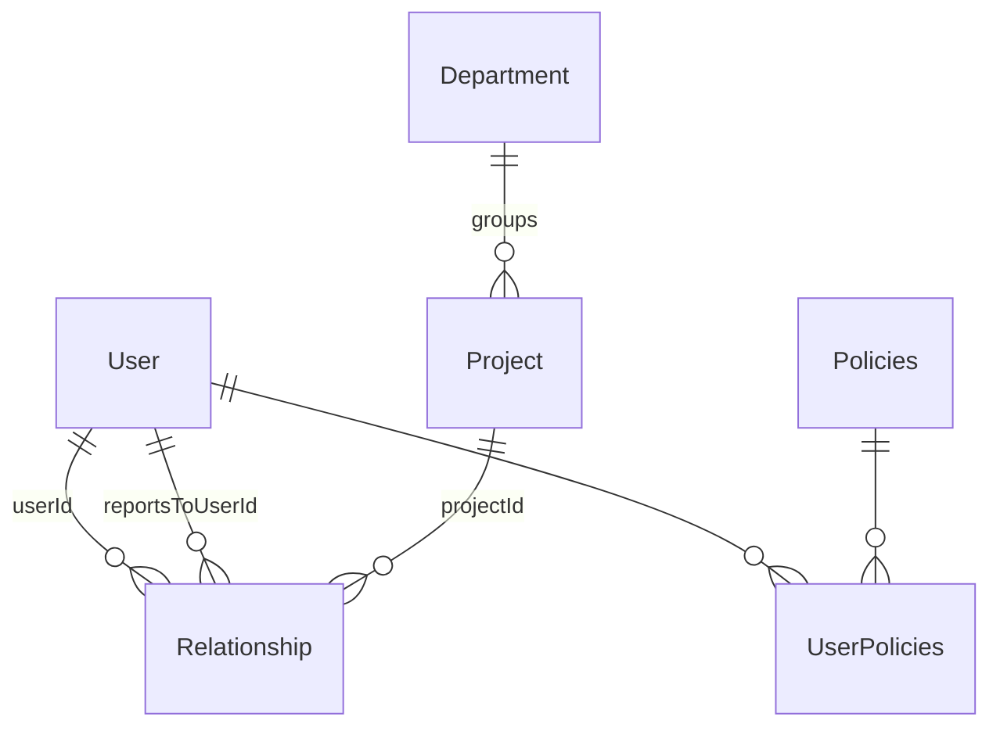

# Database Schema — Core Tables

Binding shapes for the org-fact and access-control tables. Spine: AD-7, AD-11. Prisma models must match these shapes; deviations go through the architect.

## Conventions

- All primary keys: `uuidv7`.
- PostgreSQL; Prisma ORM 7.x is the only persistence layer, and it lives exclusively in `infrastructure/` (see [domain-driven-design.md](domain-driven-design.md)).

## Entity relationships



## Tables

### User

Identity and profile root. Carries `ttId` (timetracker external identity, AD-13) from day one — email alone is not sufficient identity across systems (§6). **Never** carries role flags, manager pointers, or any access-derived field.

### Relationship (AD-11)

The org-fact edge table — the input the tier-resolution walk recurses over.

```text
Relationship {
  id              uuidv7 PK
  userId          FK -> User        // who this edge is about
  type            'direct' | 'project'
  reportsToUserId FK -> User, nullable   // set iff type = 'direct'
  projectId       FK -> Project, nullable // set iff type = 'project'
}
CHECK: (type='direct' AND reportsToUserId IS NOT NULL AND projectId IS NULL)
    OR (type='project' AND projectId IS NOT NULL AND reportsToUserId IS NULL)
UNIQUE: one active reportsTo edge per userId (the reporting relation is a tree)
```

Rules:

- Edge types share the table but **never** a target column — each target is a real, indexed FK. This is what lets `WITH RECURSIVE` walk the graph in one query (AD-10).
- No `roleOnProject` field — managerial semantics live in policy attachments (AD-7).
- Project membership derives **solely** from these rows. `Project` holds no member array; a project's members are `SELECT userId FROM Relationship WHERE projectId = :id`.

### Project / Department

Plain records. `Department` sits above `Project` in the resource hierarchy (groups projects; manager-of-manager sees all nested). No `pmUserId`, no `dmUserId`, no `users[]` — all of that is policy attachments and relationship rows. Exact Department edge modeling is **pending** (see spine Deferred) — do not extend without the architect.

### Policies (AD-7)

```text
Policies {
  id         uuidv7 PK
  operator   '==' | 'IN'          // '!=' barred from AR rules, see access-control.md
  targetType 'project' | 'department' | 'user' | ...
  targetId   uuid                  // polymorphic — NO db-level FK, by design
  targetRole string                // e.g. 'ac-manager', 'project-manager'
  type       'AR' | 'FR'
  managedBy  'sync' | 'admin'      // provenance; sync rows owned by integration only
}
```

- `targetId` has no FK because `targetType` selects the table. Consequences are accepted and handled: dangling ids fail closed on the AR path (zero joined members → zero grants); a periodic consistency sweep removes orphans; any resolution spanning the policy query plus a per-`targetType` lookup runs in **one transaction** (AD-10).

### Permissions

```text
Permissions {
  id          uuidv7 PK
  title       string   // e.g. 'create-resourcing-requests', 'assign-mentors'
  description string
}
```

The granular feature list of §2.3 — each independently grantable.

### UserPolicies

```text
UserPolicies {
  userId   FK -> User
  policyId FK -> Policies
}
```

Attachment join — one policy row shareable across many users.

## What is deliberately absent

- Any stored access-role/tier/permission result (AD-10: derived access is never persisted).
- Custom-field tables — storage model not yet decided ([custom-fields.md](custom-fields.md)).
- Profile-section tables — pending the Profile bounded-context decision (spine Deferred).
