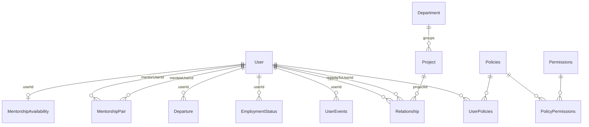

# Database Schema — Core Tables

Binding shapes for the org-fact, lifecycle, mentorship, and access-control tables. Spine: AD-7, AD-11, AD-16, AD-17, AD-19, AD-20. Prisma models must match these shapes; deviations go through the architect.

## Conventions

- All primary keys: `uuidv7`.
- PostgreSQL; Prisma ORM 7.x is the only persistence layer, and it lives exclusively in `infrastructure/` (see [domain-driven-design.md](domain-driven-design.md)).
- Audit columns (`updatedAt`, `updatedBy`, etc.) are added per-table only when there's a concrete, named consumer — not speculatively "just in case". A real change-history/audit-log is a separate, deliberately-scoped feature, not a default add-on.

## Entity relationships



## Tables

### User

Identity and profile root, owned by `user-management` ([PRD](../../_bmad-output/planning-artifacts/prds/prd-user-management-2026-08-20/prd.md)). Carries `ttId` (timetracker external identity, AD-13) from day one — email alone is not sufficient identity across systems (§6). **Never** carries role flags, manager pointers, project references, department references, or any other access-derived field — those are derived from `Relationship` (AD-11) and pending Department/Policy edges, not stored here.

```text
User {
  id              uuidv7 PK
  firstName       string
  lastName        string
  photo           string, nullable
  position        string
  country         string
  city            string
  workEmail       string, unique
  workPhone       string, nullable
  birthDay        int, nullable          // 1-31. §3.2 S1 content is literally "birthday (day and month)" -- no year is ever captured or stored, for any audience. Replaces the earlier single full-date `birthDate` design (2026-08-25 product decision: that design invented an audience-based year-redaction rule the source never states)
  birthMonth      int, nullable          // 1-12, paired with birthDay -- both null together or both set together
  companyJoinDate date
  isActive        boolean, default true  // technical account/row-retention flag; never employment status (AD-16)
  ttId            string, nullable, unique
  customFields    jsonb, default '{}'   // interim only; final storage remains open in custom-fields.md
  createdAt       timestamp
  createdBy       FK -> User
}
```

No `updatedAt`/`updatedBy` — see Conventions above; nothing here consumes a last-touch marker.

Derived, not stored: current manager, project(s), and People Partner read through `Relationship` (below); department reads through the pending Department/Policy edge model; mentor reads through `MentorshipPair`.

Users are loaded only by the idempotent seeded-population import (AD-16). No request-level employee-creation API owns this table.

### EmploymentStatus (AD-16)

Employment status is a temporal S4 fact, not `User.isActive` and not a career-timeline event:

```text
EmploymentStatus {
  id              uuidv7 PK
  userId          FK -> User
  status          'active' | 'dismissed'
  validFrom       date
  validTo         date, nullable
  departureReason string, nullable
  sourceDepartureId FK -> Departure, nullable, unique
}
UNIQUE: at most one row per user with validTo IS NULL
CHECK: (status='active' AND sourceDepartureId IS NULL AND departureReason IS NULL)
    OR (status='dismissed')
```

Intervals are half-open `[validFrom, validTo)`: applying departure closes the current `active` row at `effectiveDate` and inserts `dismissed` from that same date, setting `sourceDepartureId` (which makes the materialized fact idempotent) and `departureReason`. There is deliberately no `departure`/`leaving` `UserEvents` type.

**Import-origin dismissals (2026-09-02).** A `dismissed` row created by the seeded-population import (`IsDismissed=1` in the CSV) has **no `Departure`** — the departure predates the system. The CHECK therefore no longer requires `sourceDepartureId`/`departureReason` on a `dismissed` row; both stay nullable. The AD-20 apply-transaction still sets them explicitly for departures it processes — the constraint just no longer forbids the historical import case. `validFrom` for an import-origin `dismissed` row is the CSV `DismissedDate`.

### Departure (AD-20)

The scheduled command and worker state are separate from the applied employment fact:

```text
Departure {
  id                 uuidv7 PK
  userId             FK -> User
  effectiveDate      date
  effectiveTimeZone string
  dueAt              timestamptz
  reason             string
  state              'scheduled' | 'processing' | 'retry_wait' | 'applied'
  idempotencyKey     uuid, unique
  requestHash        string
  attempts           int, default 0
  lastError          string, nullable
  nextAttemptAt      timestamptz, nullable
  leaseUntil         timestamptz, nullable
  leaseToken         uuid, nullable
  appliedAt          timestamptz, nullable
  createdAt          timestamptz
  createdBy          FK -> User
}
UNIQUE: one non-applied Departure per user
```

At creation, the required startup-validated IANA setting `BUSINESS_TIME_ZONE` is snapshotted to `effectiveTimeZone` and `dueAt` is resolved once for `00:00`; every guard/worker compares stored `dueAt` with PostgreSQL time and never falls back to host/runtime local time. `requestHash` canonically includes endpoint version, user id, normalized ISO effective date, normalized reason, and creator id; replay rechecks current authorization before returning the original result. Key reuse with a different hash is `409`. The partial non-applied uniqueness and state machine use raw-SQL constraints where Prisma cannot express them. Workers claim eligible rows in stable `effectiveDate,id` order with skip-locked selection and a fresh `leaseToken`; apply/fail/reclaim locks the row and predicates on that token, so an expired/reclaimed worker cannot commit stale work. There is no terminal abandoned state.

The apply transaction closes/inserts `EmploymentStatus`, deactivates the account/profile, cancels open action items, system-closes mentorship pairs, ends persisted access held by the actor, and marks the Departure applied. Every effect is keyed or constrained by `Departure.id` so uncertain-commit retries cannot duplicate it. Recording is blocked by any active v1.5 manager or PP responsibility; after scheduling, new such assignments are rejected or quarantined. Legacy blockers produce an authorized remediation incident but never delay effective access cutoff. Cancellation/rescheduling are not defined.

### UserEvents

The §4.9 career-timeline log, folded into `user-management` (see [domain-driven-design.md](domain-driven-design.md)). System-written on tracked changes; PP and UM may also add or soft-delete entries manually. An event is an immutable fact, not a mutable record — §4.9's "edit... events the system inferred wrongly" is modeled as soft-deleting the wrong entry and appending a corrected one, never an in-place field update. No `updatedAt`/`updatedBy` as a result (see Conventions).

```text
UserEvents {
  id        uuidv7 PK
  userId    FK -> User
  type      string; // e.g. 'joined_company' | 'grade_change' | 'position_change'
          | 'department_change' | 'employment_type_change'
          | 'extended_leave' | 'mentorship_start' | 'mentorship_end'
  eventDate date
  details   jsonb                  // type-specific metadata, e.g. grade_change: {from, to}
  source    'system' | 'manual'
  deletedAt timestamp, nullable    // soft delete -- e.g. superseding a wrongly-inferred event
  createdAt timestamp
  createdBy FK -> User
}
```

`department_change`'s payload fields reference Department ids once the Department edge contract lands. `mentorship_start`/`mentorship_end` are fired by `MentorshipPair` transitions (AD-17).

### Relationship (AD-11)

The org-fact edge table — the input the tier-resolution walk recurses over.

```text
Relationship {
  id            uuidv7 PK
  userId        FK -> User        // who this edge is about
  type          'direct' | 'project' | 'people_partner'
  reportsToUserId FK -> User, nullable    // set iff type = 'direct' or 'people_partner'
  projectId     FK -> Project, nullable // set iff type = 'project'
}
CHECK: (type='direct' AND reportsToUserId IS NOT NULL AND projectId IS NULL)
    OR (type='project' AND projectId IS NOT NULL AND reportsToUserId IS NULL)
    OR (type='people_partner' AND reportsToUserId IS NOT NULL AND projectId IS NULL)
CHECK: userId <> reportsToUserId
UNIQUE: one reportsTo edge per userId (type='direct' only — the reporting relation is a tree)
UNIQUE: one People Partner edge per userId (type='people_partner' only)
-- "active" means the row exists: Relationship rows are hard-deleted (see Rules), no deletedAt/isActive column
```

Rules:

- Edge types share the table but never a polymorphic target column: `direct` and `people_partner` point to `User` through `reportsToUserId`; `project` points to `Project` through `projectId`. This keeps AD-10's audience walks indexable.
- No `roleOnProject` field — managerial semantics live in policy attachments (AD-7).
- Project membership derives **solely** from these rows. `Project` holds no member array; a project's members are `SELECT userId FROM Relationship WHERE projectId = :id`.
- **`DELETE` is a hard delete**, for all types. The §3.4 narrow journal, not this table, retains required organisational-change evidence. Mentorship is not stored here (AD-17).
- `people_partner` uses atomic expected-current `PUT`/`DELETE` semantics (AD-19); generic second-create behavior is not its replacement contract.
- **Migration note (rechecked 2026-08-29):** Prisma 7 can express partial indexes only through the `partialIndexes` Preview feature, which this repository does not enable; PostgreSQL `CHECK` constraints remain database-enforced. Keep this project on explicit raw SQL for these constraints unless a separate reviewed decision enables that Preview feature.

### Project / Department

Plain records. `Department` is a first-class nested entity. It routes resourcing requests, keys CDS matrix lookup together with position, and a membership change writes `department_change` to `UserEvents`. No separate Unit entity exists. Projects have no `pmUserId`, `dmUserId`, or `users[]`; managerial facts are policy attachments and membership is `Relationship`.

```text
Department {
  id          uuidv7 PK
  name        string
  externalId  string, unique          // timetracker DepartmentId
  parentId    FK -> Department, nullable   // departments nest; null = top
}

DepartmentMembership {
  id          uuidv7 PK
  userId      FK -> User
  departmentId FK -> Department
  validFrom   date
  validTo     date, nullable
}
UNIQUE: one (userId, departmentId) pair with validTo IS NULL
```

**Multi-department membership (2026-09-02).** An employee belongs to **one or more** current departments — e.g. a developer who works in both `JS` and `Python` (each is its own department) holds a current `DepartmentMembership` in each. This supersedes the earlier "exactly one current department" rule (mirrored in `docs/project-requirements.md` §4.17). Consequences: the derived S1 "department" display is a **set**, not a scalar; `department_change` `UserEvents` are add/remove events; a resourcing request still carries **one** department and routes to that department's Unit Manager (`project-requirements.md` §4.7); Unit-Manager access composes — managing any one of an employee's departments (or an ancestor of it) grants Reporting-line access to that employee. The seeded-population CSV carries **one** `DepartmentId` per row, so the import creates exactly one membership per person; additional memberships are added later (a second import, manual assignment, or the timetracker API).

Exact indexed Department parent/manager edge shapes and the recursive department-tree walk remain an explicit follow-up contract (spine Deferred). `Policies.targetType:'department'` (the Unit-Manager attachment — `targetRole:'unit-manager'`) is not honored by AD-10 until that contract is approved; the interim is fail-closed.

### MentorshipPair (AD-17)

Owned by the `mentorship` context ([mentorship.md](mentorship.md) §2.1). Updated 2026-09-01 by the mentorship technical design.

```text
MentorshipPair {
  id                 uuidv7 PK
  mentorUserId       FK -> User
  menteeUserId       FK -> User
  status             'active' | 'ended'   // single source of truth for lifecycle
  startedAt          date
  endedAt            date, nullable        // null iff status='active'
  closureNote        string, nullable      // manual note (FR-M9) or system template (FR-M14)
  endedByDepartureId uuid, nullable        // NO db FK -- accepted Policies.targetId trade-off
}
CHECK: (status='active' AND endedAt IS NULL AND closureNote IS NULL
                         AND endedByDepartureId IS NULL)
    OR (status='ended'  AND endedAt IS NOT NULL AND closureNote IS NOT NULL)
CHECK: mentorUserId <> menteeUserId
INDEX: (mentorUserId, status)      -- active-pairs-as-mentor (status query, mentor-side S13)
INDEX: (menteeUserId, status)      -- mentee-side S13, departure participant lookup
INDEX: (status)                    -- GET /mentorship-pairs, ?status= filter, departure sweep
PARTIAL UNIQUE: (mentorUserId, menteeUserId) WHERE status='active'   -- one active pair per pair; recurrence after end allowed (mentorship.md Decision 4)
PARTIAL INDEX:  (endedByDepartureId) WHERE endedByDepartureId IS NOT NULL   -- AD-20 idempotency re-scan
-- flagged (mentorship.md Decision 5): PARTIAL UNIQUE (menteeUserId) WHERE status='active' -- one active mentor per mentee
```

- `status` is the source of truth; `endedAt`/`closureNote`/`endedByDepartureId`
  are populated *by* the `active → ended` transition, never independently.
- **Normal close** (FR-M9): `closureNote` from the human, `endedByDepartureId`
  NULL. The mandatory-note gate is an application invariant in
  `EndMentorshipPairAction`; the DB `CHECK` guarantees no ended pair is noteless.
- **Departure auto-close** (FR-M14, AD-20): `closureNote` = the fixed system
  template, `endedByDepartureId` set; `EndMentorshipPairAction`'s gate is not on
  this path. `systemClosed` in any projection = `endedByDepartureId IS NOT NULL`.
  Idempotency: `UPDATE … WHERE id=:id AND status='active'` (predicate = mutation
  key) + per-career-event idempotency key.
- **No `closedBy`** — the earlier shape carried `closedBy FK -> User, nullable`;
  no scenario consumes "who ended it" (Conventions / no speculative columns).
  See [mentorship.md](mentorship.md) Decision 8.
- Ended rows retained. Start/end writes `mentorship_start`/`mentorship_end`
  `UserEvents` in the **same transaction** via `user-management`'s exported
  career-event boundary (AD-11) — mentorship never writes `UserEvents` directly.
- Pair rows **never** participate in access resolution (AD-17).
- The `CHECK` and partial indexes use reviewed custom PostgreSQL migration SQL,
  matching the repo's raw-SQL constraint pattern (Prisma 7 without the
  `partialIndexes` Preview feature cannot express them).

### MentorshipAvailability (AD-17)

The open-to-mentoring flag — a per-employee fact **independent of any pair**
(spine Deferred "S13 flag endpoint", resolved 2026-09-01). Owned by `mentorship`
([mentorship.md](mentorship.md) §2.2). **Not** a `Relationship` row, **not** a
`MentorshipPair` field.

```text
MentorshipAvailability {
  userId          uuidv7 PK, FK -> User    // 1:1 with User
  openToMentoring  boolean NOT NULL DEFAULT false
}
PARTIAL INDEX: (userId) WHERE openToMentoring   -- company-wide pool scan (FR-M4), directory filter (FR-M15)
```

- One row per user; a missing row means `false` (fail-closed — never in the pool).
- No `updatedAt`/`updatedBy` — no named consumer (Conventions). §4.9's tracked
  events are pair start/end only; the §3.4 journal does not cover mentorship.
- Written by `SetMentorshipAvailabilityAction` via
  `PATCH /users/:id/mentorship-availability` (Self-only). Never reads or writes
  `MentorshipPair` (AD-17 — clearing the flag never mutates an active pair).
- Mentorship status (`open to mentoring` / `mentor`) is **derived, never stored**
  from this row + the active-pair-as-mentor count.

### Mentorship — additive-migration ordering

Both tables land in **one additive migration** with their indexes and `CHECK`
constraints (AD-21). `endedByDepartureId` is a plain nullable `uuid` with **no
DB FK**, so the migration does **not** depend on the `Departure` table (CC-06)
landing first. There is no mentorship worker; the only ordering constraint is
that the tables precede any mentorship route or the AD-20 executor seam. The
`mentorship:assign` permission row + grant (if Decision 1 option (a)) land
through the Access Control kernel seed sequence, not a mentorship migration.

### Policies (AD-7)

```text
Policies {
  id         uuidv7 PK
  operator   '=='                 // policy-level IN deferred; do not add a set representation yet
  targetType 'project' | 'department' | 'user' | ..., nullable
  targetId   uuid, nullable        // polymorphic — NO db-level FK, by design
  targetRole string                // e.g. 'ac-manager', 'project-manager'
  type       'AR' | 'FR' NOT NULL
  managedBy  'sync' | 'admin'      // provenance; sync rows owned by integration only
}
CHECK: (type='FR' AND targetRole IS NOT NULL
                  AND targetType IS NULL AND targetId IS NULL)
    OR (type='AR' AND targetType IS NOT NULL AND targetId IS NOT NULL)
UNIQUE: targetRole WHERE type='FR'
```

- For FR rows, `Policies.id` is the stable `roleId`; the Kernel MVP seeds
  exactly one FR role with `targetRole='hr-admin'`. `targetRole` identifies the
  catalog row but is never an authorization predicate: evaluators join by ids.
- FR rows are global and therefore carry no target sentinel. AR rows require
  both target columns, with the database `CHECK` above enforcing the split.
- The `CHECK` and partial FR role-key uniqueness use reviewed custom PostgreSQL
  migration SQL, matching the repository's established raw-SQL constraint
  pattern; the Prisma model alone does not express these guarantees.
- For AR rows, `targetId` has no FK because `targetType` selects the table.
  Consequences are accepted and handled: dangling ids fail closed on the AR
  path (zero joined members → zero grants); a periodic consistency sweep
  removes orphans; any resolution spanning the policy query plus a
  per-`targetType` lookup runs in **one transaction** (AD-10).

### Permissions

```text
Permissions {
  id          uuidv7 PK
  key         string UNIQUE   // immutable lowercase context:action
  description string
}
```

`key` is the canonical, case-sensitive `isAllowed` input. The public method
accepts an open string constrained by lowercase `context:action` syntax, not a
closed union of the MVP values. Keys are append-only identities: no writer may
update one in place or bypass the Access Control-owned catalog mutation
boundary. Unknown or differently-cased keys deny. The evaluator branches on
no key.

**MVP reduction:** the deploy-time permission catalog is seed/migration-owned,
has no HTTP mutation surface, and contains exactly:

- `user-management:create`
- `user-management:deactivate`
- `user-management:list`

This three-row set does not replace or close the normative §2.3 catalog.

### PolicyPermissions

```text
PolicyPermissions {
  policyId     uuid
  policyType   'FR' NOT NULL DEFAULT 'FR'
  permissionId FK -> Permissions
}
PRIMARY KEY: (policyId, permissionId)
INDEX: (permissionId, policyId)
CHECK: policyType = 'FR'
SUPPORT KEY: UNIQUE Policies(id, type)
FOREIGN KEY: (policyId, policyType) -> Policies(id, type) ON DELETE RESTRICT
ON DELETE: RESTRICT for the Permissions foreign key in the Kernel MVP
```

Normalized FR role-to-permission grants. The composite primary key prevents
duplicate grants. The stored discriminator plus composite foreign key makes an
AR-policy grant impossible at the database boundary; application validation is
not the integrity mechanism. The discriminator `CHECK`, support key, and
composite foreign key use reviewed custom PostgreSQL migration SQL. Restricting
deletes avoids silently deciding the later role and permission deletion
contract.

### UserPolicies

```text
UserPolicies {
  userId   FK -> User
  policyId FK -> Policies
}
PRIMARY KEY: (userId, policyId)
```

Attachment join — one policy row shareable across many users.

### AccessControlBootstrap

```text
AccessControlBootstrap {
  key                 string PK          // exactly 'root-hr-admin'
  normalizedRootEmail string UNIQUE
  rootUserId          FK -> User UNIQUE ON DELETE RESTRICT
  policyId            FK -> Policies UNIQUE ON DELETE RESTRICT
}
CHECK: key = 'root-hr-admin'
```

Access Control owns this singleton as durable bootstrap provenance. It
identifies the one seed-owned root attachment without classifying later
administrator-created `hr-admin` attachments as bootstrap state.

### Kernel MVP seed contract

Before ACM-1, the deploy-time root User step **creates and validates** the root
identity, so a fresh migrated database is satisfiable without an unnamed
external prerequisite. It normalizes `ROOT_WORK_EMAIL` according to DEC-UM-007,
**stores the normalized value** so storage is canonical, and ensures exactly one
active User whose normalized `workEmail` equals it; unrelated active employees
never affect that count. Exact-one eligibility counts **all** normalized matches
first and checks active state only afterwards. The Kernel SPEC tracks it as
CAP-8 and dispatches it as ACM-0, whose production entrypoint is
`services/backend/prisma/seed.ts` (`npm run db:seed`); ACM-1's is
`services/backend/src/access-control/infrastructure/bootstrap/access-control-bootstrap.ts`
wrapped by `services/backend/scripts/bootstrap-access-control.ts`
(`npm run db:bootstrap:access-control`). Deployment order is `db:deploy` →
`db:seed` → `db:bootstrap:access-control` → `start:prod`.

> **Normalized uniqueness is writer-side, not database-enforced.**
> `users_workEmail_key` is a plain unique index on the **raw** stored
> `workEmail`. Canonical storage is what makes normalized uniqueness hold, so
> every writer must store the normalized form. Pre-existing non-normalized rows
> can still yield more than one normalized match; ACM-0 fails closed and never
> repairs them. A unique functional index over the normalized value is a
> migration on `users`, outside CAP-8's boundary, and is separately gated
> deferred work.

On a fresh database the ACM-1 seed is atomic and idempotent: exactly
the three permission rows above, exactly one `hr-admin` FR policy, exactly its
three `PolicyPermissions` grants, and exactly one `UserPolicies` attachment to
that normalized root User. There are no other seed-owned default grants.
Missing, blank, unmatched, ambiguous, inactive, or drifted root identity fails
clearly and atomically; `position='HR Admin'`, first-user selection, and any
other fallback are prohibited authorization rules.

ACM-1 begins one database transaction and first acquires a transaction-scoped
PostgreSQL advisory lock derived from
`access-control:bootstrap:root-hr-admin`. While holding that common lock, it
locks the singleton (if present), candidate User, and recorded attachment, then
revalidates normalized email, exact-one active eligibility, singleton identity,
and attachment identity before any bootstrap write and again before commit.
The advisory lock covers first creation when no singleton/attachment row
exists. Lock timeout fails atomically with actionable diagnostics.

If normalized `ROOT_WORK_EMAIL` changes after bootstrap, the singleton proves
conflicting bootstrap drift: the transaction fails and neither transfers nor
duplicates the root attachment. Later administrator-created `hr-admin`
attachments remain non-bootstrap state and are preserved.

With **no** singleton row recorded, there is no provenance to contradict. ACM-1
adopts an existing FR `hr-admin` policy by natural key (`targetRole='hr-admin'
AND type='FR'`, after verifying `operator='=='`, `managedBy='admin'`, and null
`targetType`/`targetId`), and adopts an existing `hr-admin` attachment **only
when that attachment already belongs to the located root**, then writes the
singleton. Attachments belonging to anyone else are neither adopted nor
transferred; the located root receives its own attachment and the others remain
non-bootstrap administrator state. A changed configured root in this state is
adopted rather than rejected, because nothing recorded it before. More than one
candidate root attachment is impossible — `UserPolicies` is keyed
`(userId, policyId)`. The asymmetry is deliberate: **singleton absent permits
adoption; singleton present forbids transfer.**

FR role-key uniqueness is the **partial** index `UNIQUE targetRole WHERE
type='FR'`, so an **AR** policy row carrying `targetRole='hr-admin'` is legal
and is a different object. ACM-1's lookup and ACM-2's evaluation always filter
`type='FR'`; that row is never adopted, mutated, counted toward cardinality, or
reported as drift, and it is preserved. It can hold no grant — `PolicyPermissions`
fixes `policyType='FR'` by `CHECK` and references `Policies(id, type)`
compositely — and a `UserPolicies` row attaching a user to it is not an
`hr-admin` functional-role attachment and is never bootstrap state.

Reruns non-destructively ensure the bootstrap identities and exact bootstrap
grants. Conflicting seed-owned drift fails before writes. The seed never
deletes or rewrites non-bootstrap permissions, roles, grants, or attachments
created under a later approved catalog contract.

AD-20 due/departure eligibility is deferred from this Kernel MVP because the
Departure persistence seam does not exist. The future dismissed-target
projection remains unchanged. The narrow User prerequisite above authorizes no
User Management API, CRUD, runtime role management, or other User Management
feature work.

**MVP reduction:** the Kernel MVP adds no `/roles` HTTP surface or permission
mutation port. Runtime role administration and the complete §2.3 permission
catalog remain future normative product work.

### CAP-3 invariant coverage checklist

ACM-1 Stage-1 scenarios and Stage-2 evidence must each cover **every** invariant
below. Partial coverage is not a passing ACM-1.

| # | Invariant | Observable rejection / assertion |
| --- | --- | --- |
| 1 | `Policies.type` non-null, restricted to `FR\|AR` | insert with null or a third value is rejected |
| 2 | FR/AR row-shape `CHECK` | FR row with a target, or AR row without one, is rejected |
| 3 | Partial unique index `targetRole WHERE type='FR'` | a second FR `hr-admin` row is rejected; an AR row with the same `targetRole` is accepted |
| 4 | Unique support key `Policies(id, type)` | present, and referenced by the composite foreign key below |
| 5 | `Permissions.key` unique and immutable | duplicate key rejected; in-place key update refused at the owned mutation boundary |
| 6 | `PolicyPermissions` PK `(policyId, permissionId)` | duplicate grant rejected |
| 7 | `policyType` non-null, default `FR`, `CHECK (policyType = 'FR')` | any other value rejected |
| 8 | Restrictive composite FK `(policyId, policyType) → Policies(id, type)` | **AR-policy grant rejected at the database boundary** |
| 9 | Restrictive FK `permissionId → Permissions.id` | grant referencing an unknown permission rejected |
| 10 | Permission-first index `(permissionId, policyId)` | asserted by querying `pg_indexes` against the migrated database |
| 11 | `UserPolicies` integrity — PK `(userId, policyId)`, FKs to `User` and `Policies` | attachment to an unknown user or policy rejected; duplicate attachment rejected |
| 12 | `AccessControlBootstrap` — PK `key`, `CHECK (key = 'root-hr-admin')`, unique `normalizedRootEmail`, unique restricted `rootUserId`, unique restricted `policyId` | a second singleton, a wrong key, or a duplicate reference is rejected |
| 13 | `ON DELETE RESTRICT` on all four functional-role-side foreign keys | deleting a granted permission, a granted policy, an attached user, or a singleton-referenced row is rejected |

Invariant 10 is index **existence**, not a behavior the facade can return.
Asserting it against `pg_indexes` on the migrated database is legitimate
Stage-2 evidence, and is named here so the story cannot stall on how to observe
an index.

## What is deliberately absent

- Any stored access-role/tier/permission result (AD-10: derived access is never persisted).
- Custom-field tables — storage model not yet decided ([custom-fields.md](custom-fields.md)).
- Other profile-section tables — pending the Profile bounded-context decision (spine Deferred).
